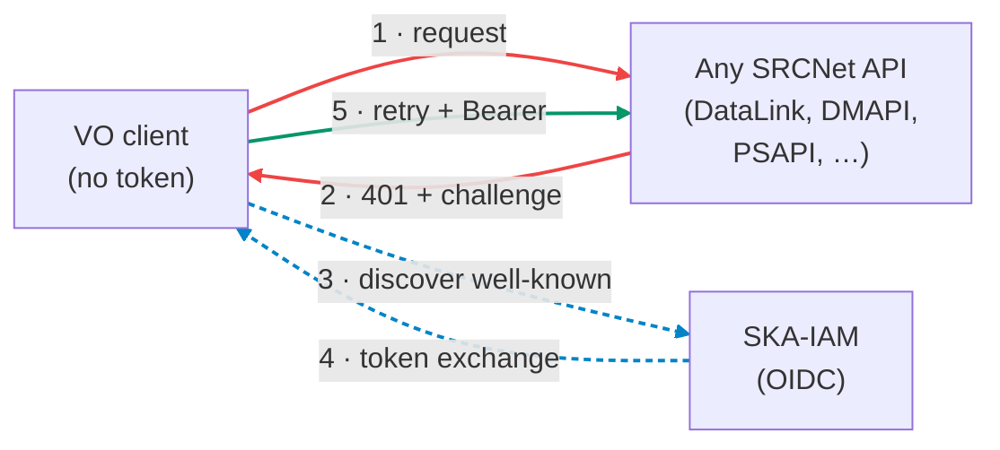
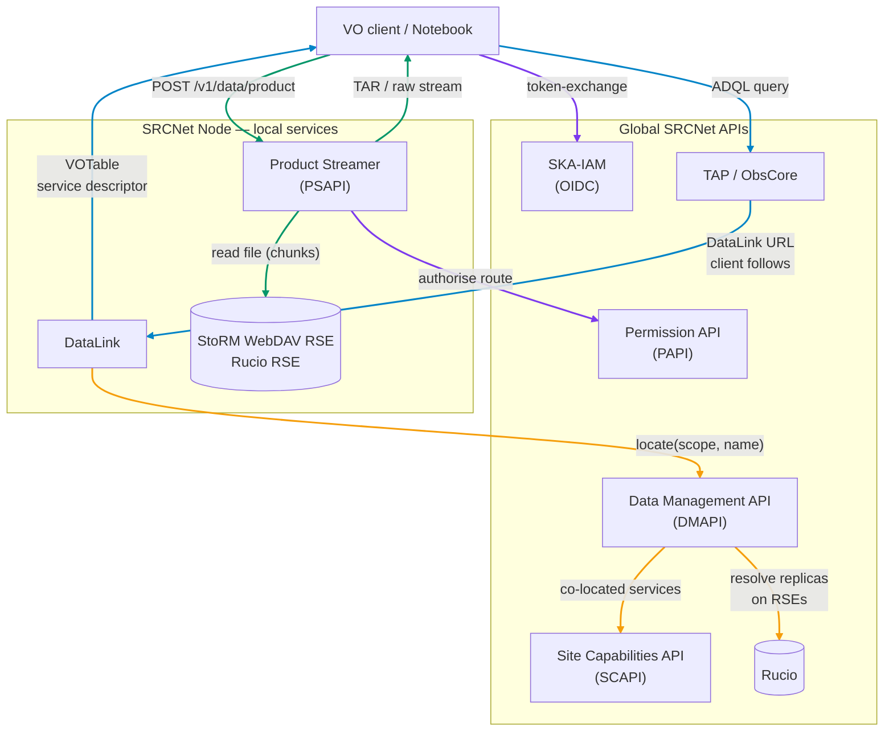
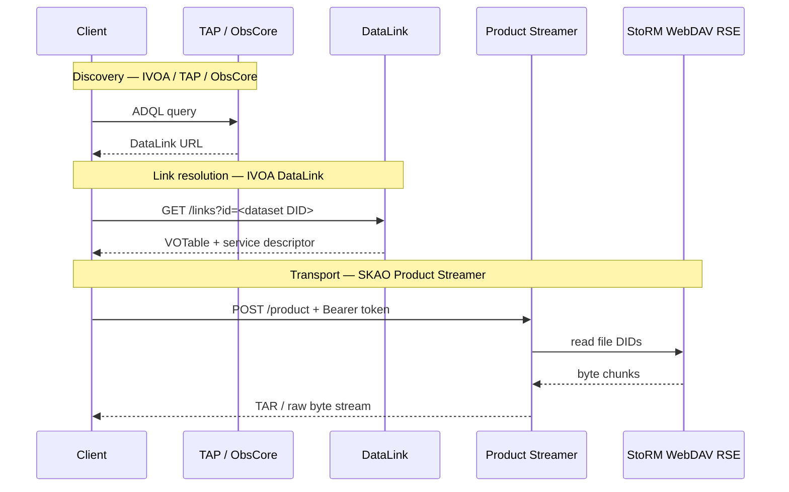
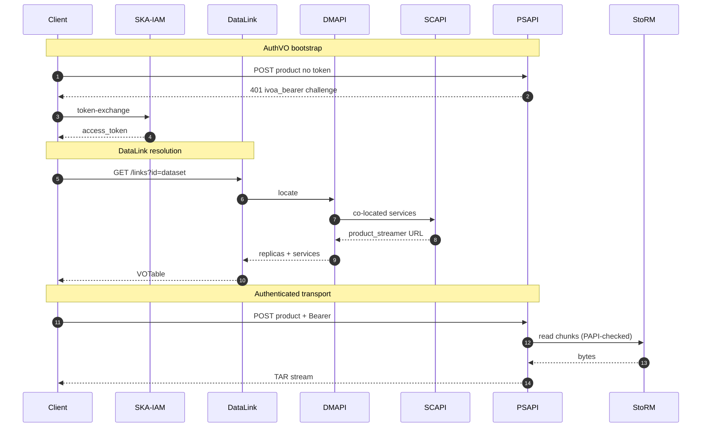

<div class="text-3xl font-bold leading-tight mt-4">
The Auth Challenge Mechanism for<br/>
SRCNet IVOA DataLink Integration<br/>
through the Product Streamer
</div>

<div class="text-base opacity-80 mt-6">
How a VO client bootstraps into SKA-IAM and walks away with the bytes
</div>

<div class="mt-8 text-sm opacity-70">
Michele Delli Veneri &nbsp;·&nbsp; SKA Observatory<br/>
IVOA Interoperability Meeting — Strasbourg, 7 – 12 June 2026
</div>

<div class="mt-6 mx-auto max-w-2xl border-l-4 border-sky-500 bg-sky-50/60 dark:bg-sky-900/20 pl-4 py-2 text-xs text-left">
  Blocks with a <span class="text-sky-700 dark:text-sky-300 font-semibold">sky-blue accent</span> in the slides are taken directly from the IVOA DataLink 1.1 Recommendation — <a href="https://www.ivoa.net/documents/DataLink/" class="underline">ivoa.net/documents/DataLink/</a>.
</div>

<div class="abs-br m-6 text-xs opacity-60">
Distributed Services & Protocols WG
</div>

<!--
20-minute slot, DSP session. Lead with the AuthVO challenge as the
narrative spine; show how DataLink + service descriptors + our Product
Streamer compose to bootstrap a naïve VO client into SKA-IAM and
deliver bytes. Many-file dataset handling is a bonus appendix.
-->

---

# Outline

- The problem: SKAO data is **token-gated**, generic VO clients are not
- The IVOA **AuthVO** bearer challenge — the spec's bootstrap
- IVOA DataLink + service descriptors as the discovery channel
- Our SRCNet implementation: DataLink + **Product Streamer (PSAPI)**
- End-to-end demo: from `401` to TAR stream
- *Bonus*: scaling DataLink for SKAO datasets (hundreds–thousands of files)
- Open questions for the community

---
layout: section
---

# 1 · The auth challenge problem

Every SKAO byte sits behind an SRCNet IAM token

---

# SKAO data is token-gated

<div class="grid grid-cols-2 gap-8 text-sm">

<div>

Every API in the SRCNet federation is locked behind **OIDC** authentication delivered by **SKA-IAM** (an Indigo IAM instance). There is no anonymous read path to SKAO products.

- **Authentication** is via short-lived OAuth2 access tokens
- **Authorisation** is per-service: a single user token must be **exchanged** for the service's audience (e.g. `product-streamer-api`, `data-management-api`) before it is accepted
- The **audience boundary** is the trust boundary — DataLink, DMAPI, PAPI and PSAPI all check it
- Storage Elements (StoRM WebDAV) only release bytes against a *scoped* RSE token issued downstream

**Generic VO clients (TOPCAT, Aladin, pyVO) have no built-in knowledge of SKA-IAM.** They need a way to *discover* where to authenticate from the response of the very first call that fails.

</div>

<div>



The first request **fails on purpose**. The body of that 401 is what bootstraps a naïve client into our realm.

</div>
</div>

---

# The IVOA AuthVO bearer challenge

<div class="text-sm">

The IVOA **AuthVO** note (an extension of <a href="https://datatracker.ietf.org/doc/html/rfc6750">RFC 6750 Bearer Token Usage</a>) defines the contract that lets a generic VO client follow a 401 into an unknown identity provider:

</div>

```http {all|1|3-7|6}
HTTP/1.1 401 Unauthorized
WWW-Authenticate:
   ivoa_bearer
   error="invalid_request",
   error_description="Missing access token",
   discovery_url="https://ska-iam.stfc.ac.uk/.well-known/openid-configuration"
```

<div class="text-sm mt-2">

The key field is **`discovery_url`**: it points at an OIDC well-known document. From that one URL, the client can read the token endpoint, the supported grant types, the audience claim policy — everything it needs to obtain a valid Bearer token and retry the request.

</div>

<div class="grid grid-cols-3 gap-4 mt-4 text-xs">
  <div class="border-l-4 border-sky-500 pl-3 py-2">
    <b>error</b> · error code from RFC 6750 — <code>invalid_request</code>, <code>invalid_token</code>, …
  </div>
  <div class="border-l-4 border-sky-500 pl-3 py-2">
    <b>error_description</b> · human-readable diagnostic for clients and operators
  </div>
  <div class="border-l-4 border-sky-500 pl-3 py-2">
    <b>discovery_url</b> · OIDC well-known endpoint for the IAM realm — the bootstrap target
  </div>
</div>

<div class="mt-3 text-xs opacity-80">

The whole talk hangs on this challenge. <b>Where</b> in our stack does it live? On the <b>Product Streamer</b> — that's where the bytes are, and that's where the audience boundary actually matters.

</div>

---
layout: section
---

# 2 · IVOA DataLink, briefly

`REC-DataLink-1.1` — 2023-12-15

---

# The `{links}` endpoint

<div class="border-l-4 border-sky-500 bg-sky-50/40 dark:bg-sky-900/15 pl-4 py-2 text-sm">

A DALI-sync resource. The client sends one or more **ID** values; the service responds with a **VOTable** of links. Mandatory parameters: `ID` (one or more identifiers) and `RESPONSEFORMAT` (a no-op for `votable`).

```
GET {base}/links?ID=<dataset-id>   →   application/x-votable+xml;content=datalink
```

Each row in the response has **exactly one of** `access_url`, `service_def`, or `error_message`.

</div>

<div class="mt-2 border-l-4 border-sky-500 bg-sky-50/40 dark:bg-sky-900/15 pl-4 py-2 text-xs">

**Required columns** (DataLink spec, Table 1):

| `ID` | `access_url` | `service_def` | `error_message` | `semantics` | `description` | `content_type` | `content_length` |
|---|---|---|---|---|---|---|---|
| input identifier | URL to data or service | ref to a `<RESOURCE>` | when no URL can be built | term from a vocabulary | human-readable label | MIME type | bytes |

</div>

<div class="mt-2 border-l-4 border-sky-500 bg-sky-50/40 dark:bg-sky-900/15 pl-4 py-2 text-xs">

`semantics` values like `#this`, `#preview`, `#progenitor`, `#cutout` come from the core DataLink vocabulary at `http://www.ivoa.net/rdf/datalink/core`.

</div>

---

# Service descriptors

<div class="border-l-4 border-sky-500 bg-sky-50/40 dark:bg-sky-900/15 pl-4 py-2 text-sm">

A **service descriptor** is metadata that ships *inside* the VOTable to tell a client **how to invoke a related service**. It's a `<RESOURCE type="meta" utype="adhoc:service">` block. A row in the results table references it via `service_def="<resource-ID>"`.

</div>

<div class="mt-2 border-l-4 border-sky-500 bg-sky-50/40 dark:bg-sky-900/15 pl-4 py-2">

```xml {all|1|2|3|4-8|5}
<RESOURCE type="meta" ID="soda-sync" utype="adhoc:service">
  <PARAM name="accessURL"   value="https://example.org/soda"/>
  <PARAM name="standardID"  value="ivo://ivoa.net/std/SODA#sync-1.0"/>
  <GROUP name="inputParams">
    <PARAM name="ID"     ucd="meta.id;meta.dataset" value="ivo://..."/>
    <PARAM name="CIRCLE" ucd="obs.field" datatype="double" arraysize="3"/>
    <PARAM name="BAND"   ucd="em.wl;stat.interval" datatype="double" arraysize="2"/>
  </GROUP>
</RESOURCE>
```

</div>

<div class="text-xs grid grid-cols-2 gap-x-8 gap-y-1 mt-3">
  <div><b>1 · the resource block</b> — <code>utype="adhoc:service"</code> identifies it as a service descriptor; the <code>ID</code> is what <code>service_def</code> rows point at.</div>
  <div><b>2 · accessURL</b> — the endpoint the client should hit.</div>
  <div><b>3 · standardID (optional)</b> — declares the service implements an IVOA standard (here SODA-sync-1.0) so generic VO clients can reason about it.</div>
  <div><b>4–8 · inputParams</b> — the parameters the service expects. The client substitutes values for each <code>PARAM</code> to build the actual call.</div>
</div>

<div class="text-xs mt-3 opacity-80">
This is the <b>extension point</b> we use to advertise our auth-bearing transport service (the <b>Product Streamer</b>) — coming up shortly.
</div>

---
layout: section
---

# 3 · The SRCNet implementation

How DataLink hands a VO client off to the auth challenge

---

# SRCNet service federation

<div class="mt-2 text-sm">

Global services hold the federation state and discovery surface. Each SRCNet node exposes local access to storage through its Product Streamer and StoRM RSE.

</div>

<div class="mt-4 border-l-4 border-sky-500 bg-sky-50/40 dark:bg-sky-900/15 pl-4 py-3">
  <div class="text-xs font-semibold uppercase opacity-70 mb-2">Global SRCNet APIs and Services</div>
  <div class="grid grid-cols-6 gap-2 text-xs">
    <div class="border border-slate-300 dark:border-slate-600 px-2 py-2 text-center">Indigo IAM<br/><span class="opacity-65">OIDC</span></div>
    <div class="border border-slate-300 dark:border-slate-600 px-2 py-2 text-center">TAP / ObsCore<br/><span class="opacity-65">discovery</span></div>
    <div class="border border-slate-300 dark:border-slate-600 px-2 py-2 text-center">Permission API<br/><span class="opacity-65">PAPI</span></div>
    <div class="border border-slate-300 dark:border-slate-600 px-2 py-2 text-center">Site Capabilities API<br/><span class="opacity-65">SCAPI</span></div>
    <div class="border border-slate-300 dark:border-slate-600 px-2 py-2 text-center">Data Management API<br/><span class="opacity-65">DMAPI</span></div>
    <div class="border border-slate-300 dark:border-slate-600 px-2 py-2 text-center">Rucio<br/><span class="opacity-65">data replication</span></div>
  </div>
</div>

<div class="mt-5 grid grid-cols-3 gap-4 text-xs">
  <div class="border-l-4 border-emerald-400 bg-emerald-50/40 dark:bg-emerald-900/15 pl-3 py-3">
    <div class="font-semibold mb-2">SRCNet Node A</div>
    <div class="grid gap-2">
      <div class="border border-slate-300 dark:border-slate-600 px-2 py-2">DataLink</div>
      <div class="border border-slate-300 dark:border-slate-600 px-2 py-2">Product Streamer <span class="opacity-65">(PSAPI)</span></div>
      <div class="border border-slate-300 dark:border-slate-600 px-2 py-2">StoRM WebDAV RSE<br/><span class="opacity-65">registered in Rucio</span></div>
    </div>
  </div>

  <div class="border-l-4 border-emerald-400 bg-emerald-50/40 dark:bg-emerald-900/15 pl-3 py-3">
    <div class="font-semibold mb-2">SRCNet Node B</div>
    <div class="grid gap-2">
      <div class="border border-slate-300 dark:border-slate-600 px-2 py-2">DataLink</div>
      <div class="border border-slate-300 dark:border-slate-600 px-2 py-2">Product Streamer <span class="opacity-65">(PSAPI)</span></div>
      <div class="border border-slate-300 dark:border-slate-600 px-2 py-2">XrootD RSE<br/><span class="opacity-65">registered in Rucio</span></div>
    </div>
  </div>

  <div class="border-l-4 border-emerald-400 bg-emerald-50/40 dark:bg-emerald-900/15 pl-3 py-3">
    <div class="font-semibold mb-2">SRCNet Node C</div>
    <div class="grid gap-2">
      <div class="border border-slate-300 dark:border-slate-600 px-2 py-2">DataLink</div>
      <div class="border border-slate-300 dark:border-slate-600 px-2 py-2">Product Streamer <span class="opacity-65">(PSAPI)</span></div>
      <div class="border border-slate-300 dark:border-slate-600 px-2 py-2">StoRM WebDAV RSE<br/><span class="opacity-65">registered in Rucio</span></div>
    </div>
  </div>
</div>

<div class="mt-3 text-xs opacity-75">
Every StoRM endpoint is a Rucio Storage Element (RSE); Rucio is the global catalogue that knows which RSE holds each file replica.
</div>

---

# The SKAO stack around DataLink

<div class="grid grid-cols-[1.35fr_0.65fr] gap-6 items-start">

<div>



<div class="mt-2 grid grid-cols-4 gap-2 text-[10px]">
  <div class="border-l-4 border-violet-500 pl-2">Auth / Perm Flow</div>
  <div class="border-l-4 border-sky-500 pl-2">Discovery</div>
  <div class="border-l-4 border-amber-500 pl-2">Data Location</div>
  <div class="border-l-4 border-emerald-500 pl-2">Data Transport</div>
</div>

</div>

<div class="text-sm">

**Local** means local to an SRCNet node.

DataLink is a **thin bridge**: it asks DMAPI to *locate* a DID, then formats the answer as a VOTable.

PSAPI is the **streaming proxy**: it validates the caller's token audience with PAPI, then pulls bytes off the node-local RSE — **this is the box that issues the AuthVO challenge.**

</div>

</div>

---

# The `/links` route — single entry point

```py {all|6-9|11-15}
@api_version(1)
@datalink_router.get("/links", response_class=HTMLResponse, tags=["DataLink"])
async def links(
    request: Request,
    params: DataLinkParameters = Depends(),
    dm_token: str = Depends(get_dm_token),
) -> HTMLResponse:
    """Generate DataLink XML for a given DID."""
    did_data = datalink_tasks.fetch_did_data(
        params.did, params.client_ip_address,
        params.sort, params.must_include_soda, dm_token,
    )
    is_dataset = did_data["is_dataset"]
    if is_dataset:
        return _render_dataset_response(...)
    return _render_file_response(...)
```

One DID in. One VOTable out. The VOTable always carries a **`product-streamer` service descriptor** when a PSAPI is co-located with the storage area.

---

# Handing off to the auth-bearing transport service

<div class="text-sm">

For every `locate`, DMAPI returns the active **Product Streamer** endpoint for the storage area (via SCAPI). DataLink surfaces it as a plain DataLink service descriptor — the exact mechanism from the IVOA standard.

</div>

```xml
<RESOURCE type="meta" ID="product-streamer" utype="adhoc:service">
  <PARAM name="accessURL" value="http://psapi-core:8080/v1/data/product"/>
  <GROUP name="inputParams">
    <PARAM name="ID" ucd="meta.id;meta.dataset"
           value="ivo://local.srcdev.skao.int?SKA-Mid.integration/02/ba/.../test_0.fits"/>
  </GROUP>
</RESOURCE>
```

No `standardID` — it's a custom service. But the descriptor's shape is canonical: the client picks up `accessURL`, fills in `ID`, and POSTs to PSAPI with a Bearer token.

A `#product-stream` row in the results table cross-references the descriptor so clients that prefer to discover services through the table see it there too.

<div class="mt-3 text-xs opacity-80">
This descriptor is also <b>where the audience boundary becomes visible</b>: the moment the client follows <code>accessURL</code>, it crosses into PSAPI — and PSAPI is the one that will issue the AuthVO challenge if the Bearer is missing or has the wrong audience.
</div>

---
layout: section
---

# 4 · The Product Streamer

`ska-src-dm-product-service` — the auth-challenge bearer

---

# What PSAPI does

<div class="grid grid-cols-2 gap-6 text-sm">

<div>

A **streaming proxy** in front of the StoRM RSE filesystem.

- Single `POST /v1/data/product` route
- Body: a list of `{did, path}` items
- One item, file path → raw bytes (with `Range` support, `206 Partial Content`)
- Multiple items (or directory) → **uncompressed TAR stream** (`application/x-tar`)
- No buffering on disk, no intermediate compression

The route is gated by **two** independent auth checks:

1. **Token presence** — directly in the handler, returns IVOA AuthVO `ivoa_bearer` 401
2. **Audience + permission** — delegated to PAPI

</div>

<div>

```python
@product_router.post("/data/product")
async def post_product(
    request: Request,
    products: list[ProductDID],
):
    caller_token = request.headers.get("authorization", "")\
        .removeprefix("Bearer ").strip()
    if not caller_token:
        raise MissingToken()           # 401 IVOA AuthVO

    safe_paths = [_resolve_safe_path(p.path) for p in products]
    if len(safe_paths) == 1 and os.path.isfile(safe_paths[0]):
        return StreamingResponse(_stream_file(...))
    return StreamingResponse(
        _stream_tar_archive(safe_paths),
        media_type="application/x-tar",
    )
```

</div>
</div>

---

# The AuthVO challenge in PSAPI

When the caller forgets to send a token, PSAPI replies **401** with the IVOA AuthVO bearer challenge:

```http {all|1|3-6|5}
HTTP/1.1 401 Unauthorized
Content-Type: application/json

{ "detail": "Unauthorized WWW-Authenticate: ivoa_bearer
   error=\"invalid_request\",
   error_description=\"Missing access token\",
   discovery_url=\"https://ska-iam.stfc.ac.uk/.well-known/openid-configuration\"" }
```

The **`discovery_url`** is the whole point: a generic VO client that has never heard of SKA-IAM can follow it, fetch the OIDC well-known document, run a client-credentials (or token-exchange) grant for the **`product-streamer-api`** audience, and retry the same request with a valid Bearer.

A second `401` is raised by the **Permissions API** (PAPI) if the token *is* present but its audience doesn't match — that's the route-level authorisation check, not just a presence check.

<div class="mt-4 grid grid-cols-2 gap-4 text-xs">
  <div class="border-l-4 border-amber-500 pl-3 py-2">
    <b>PSAPI handler check</b> — token presence → AuthVO 401 with <code>discovery_url</code> (RFC 6750 + AuthVO).
  </div>
  <div class="border-l-4 border-violet-500 pl-3 py-2">
    <b>PAPI delegated check</b> — audience + route ACL → 401 from policy enforcement point.
  </div>
</div>

---
layout: section
---

# 5 · Scaling DataLink for SKAO datasets

What happens when "a product" is *thousands* of files

---

# SKA datasets are not single files

<div class="grid grid-cols-2 gap-8 text-sm">

<div>

**SKAO will produce ~700 PB / year of science-ready data products.**

A *dataset* in SKA is rarely a single file: depending on the product type it can hold **hundreds to thousands** of files — typically **FITS** images, weights, primary-beam and metadata sidecars, or **Measurement Set v2 (MSv2)** directory trees for visibilities.

- **Discovery** is via TAP / ObsCore — query result already includes the DataLink URL
- Files are stored on **Rucio Storage Elements** (RSEs) — typically StoRM WebDAV
- Identifiers are **Rucio DIDs** of the form `scope:name`
- A *dataset* DID is a Rucio container whose constituents are *file* DIDs

</div>

<div>



</div>
</div>

---
layout: two-cols-header
---

# Divergence · Dataset → one call, all children

::left::

**Standard expectation**

Submit ID values in batches; the server returns *one or more rows per ID*.

To get every file in a dataset of *N* constituents the typical client pattern is:

1. `GET /links?ID=<dataset>` → discover constituents
2. `GET /links?ID=<file_1>` → PFN for file 1
3. `GET /links?ID=<file_2>` → PFN for file 2
4. … *N* round-trips total

::right::

**SKAO behaviour**

A single `GET /links?id=<dataset>` returns the **PFNs for every constituent** plus the co-located service descriptors — **in one VOTable**.

```python
if is_dataset:
    for entry in location_response:
        for replica in entry["replicas"]:
            constituent_links.append({
              "access_url": replica,
              "path_on_storage": ...,
              "semantics": "#child",
            })
```

One round-trip; client can build the whole download payload.

---

# What the dataset VOTable looks like

<div class="text-sm">

Each `#child` row carries a **per-file IVOA ID** whose query-string fragment is the path on storage — the client can derive every local path without a second call.

</div>

```xml {all|3-12|14-19}
<VOTABLE ...>
  <RESOURCE type="results"><TABLE>
    <!-- one row per constituent file, all with semantics=#child -->
    <TR>
      <TD>ivo://local.srcdev.skao.int?SKA-Mid.integration/02/ba/.../test_0.fits</TD>
      <TD>davs://storm2.local:8444/sa/.../test_0.fits</TD>
      <TD/><TD/>
      <TD>#child</TD>
      <TD>Constituent file</TD>
      <TD/><TD/><TD/>
    </TR>
    <!-- … #child rows for every other file in the dataset … -->
  </TABLE></RESOURCE>

  <RESOURCE type="meta" ID="product-streamer" utype="adhoc:service">
    <PARAM name="accessURL" value="http://psapi-core:8080/v1/data/product"/>
    <GROUP name="inputParams">
      <PARAM name="ID" value="ivo://...?<scope>/<name>"/>
    </GROUP>
  </RESOURCE>
</VOTABLE>
```

---

# Why we did it this way

<v-clicks>

- **Network economics.** SRCs are globally distributed; a 1500-file VLBI dataset over 200 ms RTT is ~5 min of pure latency at one-call-per-file.
- **Atomic snapshot.** All children come from the *same* `locate` response, so replica selection and co-located services stay consistent for the whole dataset.
- **Clients stay simple.** A notebook can parse one VOTable, build one POST body, and stream the whole product.
- **`#child` is already in the core vocab** — we are using it in the spirit the spec describes (the *multiple files per dataset* use case), just at the *response* level rather than via the *recursive DataLink* pattern.

</v-clicks>

<v-click>

<div class="mt-6 p-4 bg-yellow-50 dark:bg-yellow-900/20 border-l-4 border-yellow-500 text-sm">
  <b>The tension:</b> the spec assumes <i>one ID → links for that ID</i>. We're returning <i>one dataset ID → links for the dataset and every constituent</i>. Is that a legitimate generalisation, or do we owe the community a `#child`-recursion sidecar?
</div>

</v-click>

---
layout: section
---

# 6 · End-to-end demo

`demo/product_streamer_demo.ipynb`

---

# Step 1 — Acquire a scoped token

```python
from ska_test_utils.auth import get_psapi_token

# admin token exchanged for product-streamer-api audience
psapi_token = get_psapi_token()
```

The notebook uses an `OAuth2Session` client-credentials grant against SKA-IAM, with `audience=product-streamer-api`. In production a user obtains the token interactively; the audience is the **only** thing PSAPI's permission check looks at beyond presence.

<div class="mt-4 text-xs opacity-70">

The same pattern is what DataLink itself uses to talk to DMAPI — see `OAuth2ServiceToken.get()` in `ska-src-dm-datalink`. The chain of audiences is the trust boundary.

</div>

---

# Step 2 — Query DataLink for the dataset

```python {all|1-6|8-18}
dataset_did = "SKA-Mid.integration:EB-E6E2BBFC.product-0e8afdfc"

dl = requests.get(
    f"{DATALINK_URL}/v1/links",
    params={"id": dataset_did}, timeout=30,
)

root = ET.fromstring(dl.content)
ps_res = root.find('.//v:RESOURCE[@ID="product-streamer"]', VOTABLE_NS)
product_streamer_url = ps_res.find('.//v:PARAM[@name="accessURL"]', VOTABLE_NS).get("value")

products_payload = []
for row in root.findall('.//v:RESOURCE[@type="results"]//v:TR', VOTABLE_NS):
    tds = row.findall("v:TD", VOTABLE_NS)
    if "#child" in [td.text for td in tds if td.text]:
        ivoa_id = tds[0].text
        path_on_storage = ivoa_id.split("?", 1)[1]   # everything after '?'
        products_payload.append({"did": ..., "path": f"/storm-rse2/{path_on_storage}"})
```

**One round-trip** to DataLink and we have a fully formed POST body for PSAPI.

---

# Step 3 — Stream the dataset as a TAR archive

```python
response = requests.post(
    product_streamer_url, json=products_payload,
    headers={"Authorization": f"Bearer {psapi_token}"},
    stream=True, timeout=(30, 600),
)

# Content-Type: application/x-tar
with tarfile.open(fileobj=BytesIO(response.content), mode="r:") as tar:
    members = tar.getmembers()
```

```
Status          : 200
Content-Type    : application/x-tar
TAR archive contains 3 member(s):
  test_EB-E6E2BBFC_0.fits     1,048,576 bytes
  test_EB-E6E2BBFC_1.fits     1,048,576 bytes
  test_EB-E6E2BBFC_2.fits     1,048,576 bytes
```

The tarball is **built on the fly** as bytes are pulled off the RSE — memory usage on PSAPI stays flat regardless of dataset size.

---

# Step 4 — The auth challenge in action

<div class="grid grid-cols-2 gap-6 text-sm">

<div>

**No token → AuthVO bootstrap**

```python
requests.post(ps_url, json=[...])
# → 401
# detail: Unauthorized WWW-Authenticate:
#   ivoa_bearer error="invalid_request",
#   discovery_url="https://ska-iam.../.well-known/..."
```

The `discovery_url` is what a naïve VO client follows to learn how to talk to SKA-IAM. After token exchange for `product-streamer-api`, it retries and succeeds.

</div>

<div>

**Wrong audience → PAPI policy 401**

```python
raw_token = get_user_token()  # not exchanged
requests.post(ps_url, json=[...],
  headers={"Authorization": f"Bearer {raw_token}"})
# → 401 from PAPI audience check
```

PAPI is the policy enforcement point: it owns route-level permissions and audience validation. PSAPI itself only checks presence.

</div>
</div>

---

# Full sequence



---
layout: section
---

# 7 · Open questions

For the DSP / DAL WGs

---

# Where we'd like community input

<v-clicks>

- **AuthVO `ivoa_bearer` + `discovery_url`.** Our 401 payload encodes the IAM discovery URL inline. Is that the convention people are converging on, or do you prefer registering the IAM as an SSO endpoint elsewhere (`<securityMethod>` in VOResource, capabilities…)?
- **Custom service descriptors.** `#product-stream` and a custom `accessURL` with a single `ID` input feels like the simplest possible service descriptor — but should we register a `standardID` for "give me bytes for this DID"?
- **`link_auth` and `link_authorized`.** We don't emit these today. Worth adding so generic clients know up-front that every PFN will challenge them?
- **Dataset-level DataLink.** Is "one dataset ID → many `#child` rows in one VOTable" a legitimate reading of the spec, or is the recursive-DataLink pattern the only blessed shape? The cost of recursion at SKA scale is real.

</v-clicks>

---
layout: center
class: text-center
---

# Thank you

<div class="text-base opacity-80 mt-6">
Code &nbsp;·&nbsp; <code>gitlab.com/ska-telescope/src/src-dm/ska-src-dm-datalink</code><br/>
&nbsp; &nbsp; &nbsp; &nbsp; <code>gitlab.com/ska-telescope/src/src-dm/ska-src-dm-product-service</code><br/>
Slides &nbsp;·&nbsp; <code>github.com/MicheleDelliVeneri/IVOA-Strasbourg-Product-Streamer</code>
</div>

<div class="mt-10 text-sm opacity-60">
michele.delliveneri@skao.int &nbsp;·&nbsp; SKAO Data Management
</div>
