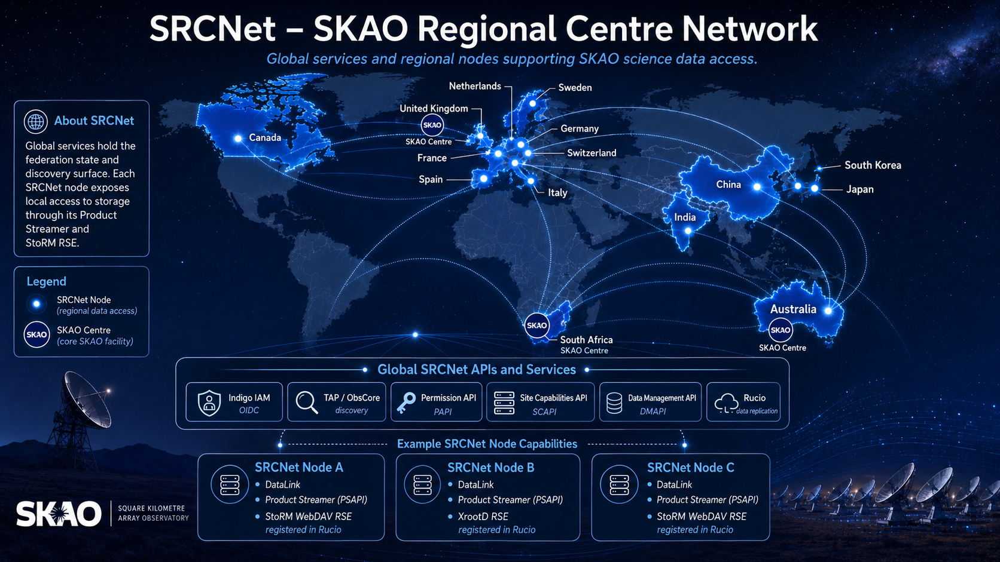
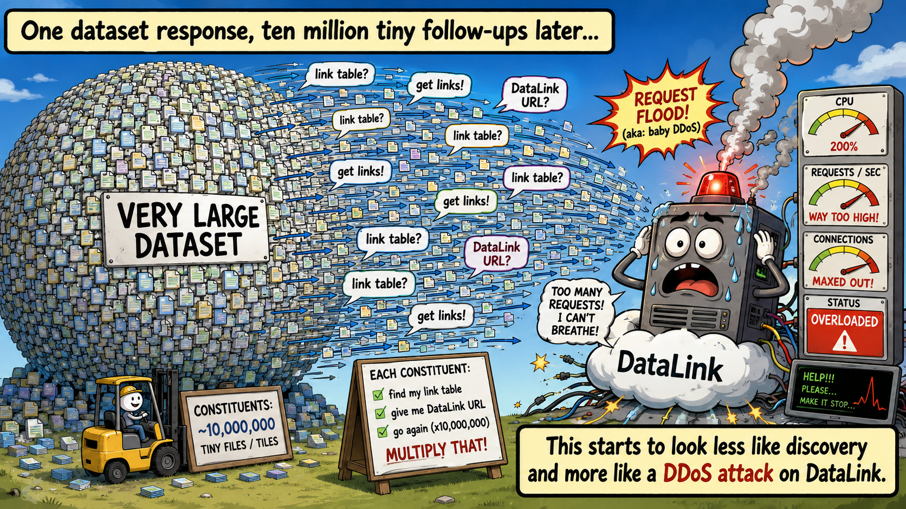
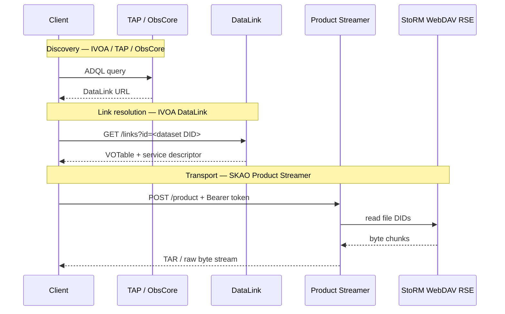
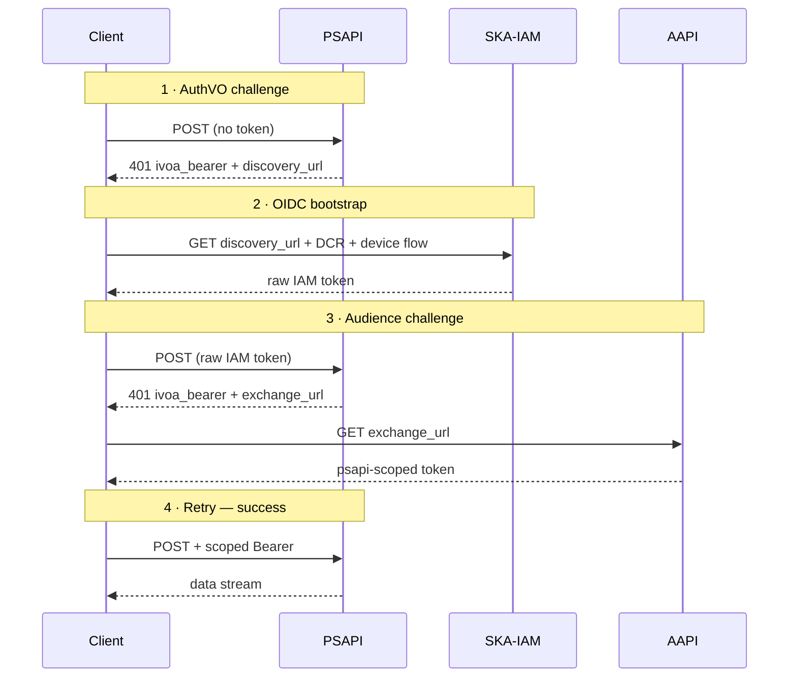
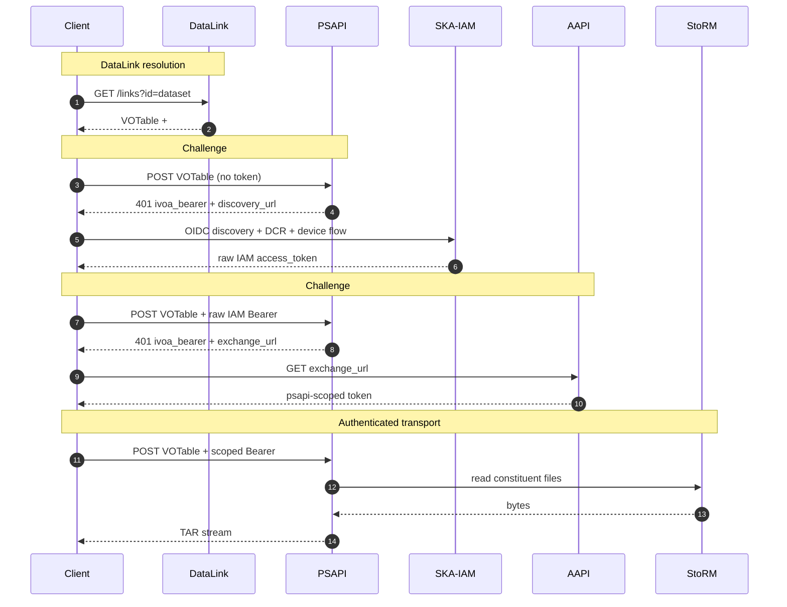

<div class="flex justify-start mb-4">
  
</div>

<div class="text-3xl font-bold leading-tight mt-2" style="color:#070068;">
The Auth Challenge Mechanism for<br/>
SRCNet IVOA DataLink Integration<br/>
through the Product Streamer
</div>

<div class="text-base mt-6" style="color:#333333;">
How a VO client bootstraps into SKA-IAM and walks away with the bytes
</div>

<div class="mt-8 text-sm" style="color:#555555;">
Michele Delli Veneri &nbsp;·&nbsp; SKA Observatory<br/>
IVOA Interoperability Meeting — Strasbourg, 7 – 12 June 2026
</div>

<div class="mt-6 mx-auto max-w-2xl border-l-4 border-[#E70068] bg-[#E70068]/8 pl-4 py-2 text-xs text-left" style="color:#333333;">
  Blocks with a <span class="text-[#E70068] font-semibold">magenta accent</span> in the slides are taken directly from the IVOA DataLink 1.1 Recommendation — <a href="https://www.ivoa.net/documents/DataLink/" class="underline">ivoa.net/documents/DataLink/</a>.
</div>

<div class="abs-br m-6 text-xs" style="color:#777777;">
Distributed Services & Protocols WG
</div>

<!--
20-minute slot, DSP session. Lead with the AuthVO challenge as the
narrative spine; show how DataLink + service descriptors + our Product
Streamer compose to bootstrap a naïve VO client into SKA-IAM and
deliver bytes. Many-file dataset handling is a bonus appendix.
-->

---

# Outline

1. **The problem** — SKAO data is token-gated; generic VO clients (TOPCAT, Aladin, pyVO) are not
2. **IVOA DataLink** in 90 seconds — `{links}` endpoint and service descriptors
3. **Our SRCNet implementation** — DataLink + Product Streamer API (PSAPI), and how PSAPI issues
   - **Challenge #1** — AuthVO `ivoa_bearer` with `discovery_url` (no token)
   - **Challenge #2** — AuthVO `ivoa_bearer` with `exchange_url` (wrong audience)
4. **Scaling** DataLink for SKAO datasets — hundreds-to-thousands of files in one VOTable
5. **End-to-end demo** — cold-start client to TAR stream
6. **Open questions** for the community

---
layout: section
---

# 1 · The auth challenge problem

Every SKAO byte sits behind an SRCNet IAM token

---

# SKAO data is token-gated

<div class="grid grid-cols-2 gap-8 text-sm">

<div>

Every API in the SRCNet federation is locked behind **OIDC** authentication delivered by **SKA-IAM** our Indigo Identity and Access Management instance. 
There is no anonymous read path to SKAO products.

- **Authentication** is via short-lived OAuth2 access tokens
- **Audience boundary**:  all the token gated APIs in SRCNet accept only correctly scoped tokens. This limits the capacity of a token in case of a security breach. **Authorisation** is per-service: a user token must be **exchanged** for the service's audience (e.g. `product-streamer-api`) before it is accepted.

Generic VO clients (TOPCAT, Aladin, pyVO) have no built-in knowledge of SKA-IAM. 
<!---
PSAPI bootstraps them with **two consecutive challenges**:
#1. **AuthVO challenge** — no token → 401 carrying `discovery_url`
2. **Audience challenge** — wrong audience → 401 carrying `exchange_url`
-->
</div>

<div class="flex items-center justify-center overflow-hidden">
  
</div>
</div>

---
layout: section
---

# 2 . The SKA Data Problem 

---

# SKA datasets are not single files

<div class="grid grid-cols-2 gap-8 items-center">

<div class="text-sm">

**SKAO will produce ~700 PB / year of science-ready data products.**

A *dataset* in SKA is rarely a single file: depending on the product type it can hold **hundreds to thousands** of files — typically **FITS** images, weights, primary-beam and metadata sidecars, or **Measurement Set v2 (MSv2)** directory trees for visibilities.

- Files are stored on **Rucio Storage Elements** (RSEs) — typically StoRM WebDAV
- Identifiers are **Rucio DIDs** of the form `scope:name`
- A *dataset* DID is a Rucio container whose constituents are *file* DIDs

</div>

<div class="flex items-center justify-center">
  
</div>

</div>


---
layout: section
---

# 3 . The SRCNet Federation 

---

<div class="flex items-center justify-center">
  
</div>

---
layout: section
---
# 4 · IVOA DataLink, briefly

`REC-DataLink-1.1` — 2023-12-15

---

# The `{links}` endpoint

<div class="border-l-4 border-[#E70068] bg-[#E70068]/5 dark:bg-[#E70068]/8 pl-4 py-2 text-sm">

A DALI-sync resource. The client sends one or more **ID** values; the service responds with a **VOTable** of links. Mandatory parameters: `ID` (one or more identifiers) and `RESPONSEFORMAT` (a no-op for `votable`).

```
GET {base}/links?ID=<dataset-id>   →   application/x-votable+xml;content=datalink
```

Each row in the response has **exactly one of** `access_url`, `service_def`, or `error_message`.

</div>

<div class="mt-2 border-l-4 border-[#E70068] bg-[#E70068]/5 dark:bg-[#E70068]/8 pl-4 py-2 text-xs">

**Required columns** (DataLink spec, Table 1):

| `ID` | `access_url` | `service_def` | `error_message` | `semantics` | `description` | `content_type` | `content_length` |
|---|---|---|---|---|---|---|---|
| input identifier | URL to data or service | ref to a `<RESOURCE>` | when no URL can be built | term from a vocabulary | human-readable label | MIME type | bytes |

</div>

<div class="mt-2 border-l-4 border-[#E70068] bg-[#E70068]/5 dark:bg-[#E70068]/8 pl-4 py-2 text-xs">

`semantics` values like `#this`, `#preview`, `#progenitor`, `#cutout` come from the core DataLink vocabulary at `http://www.ivoa.net/rdf/datalink/core`.

</div>

---

# Standard DataLink response for a 1000-file SKA dataset

<div class="text-sm">

Standard IVOA recursive pattern: `GET /links?ID=<dataset>` returns **one row per constituent file**, each row pointing to that file's own DataLink endpoint. The client must follow every link to get the actual download URL. <span class="opacity-70">↓ scroll the snippet</span>

</div>

<div class="mt-2 max-h-[400px] overflow-y-auto rounded border border-[#E70068] bg-[#E70068]/5 dark:bg-[#E70068]/8">

```xml {all}
<VOTABLE xmlns="http://www.ivoa.net/xml/VOTable/v1.3" version="1.4">
  <RESOURCE type="results">
    <INFO name="standardID" value="ivo://ivoa.net/std/DataLink#links-1.1"/>
    <TABLE>
      <FIELD name="ID"             datatype="char" arraysize="*" ucd="meta.id;meta.main"/>
      <FIELD name="access_url"     datatype="char" arraysize="*" ucd="meta.ref.url"/>
      <FIELD name="service_def"    datatype="char" arraysize="*" ucd="meta.ref"/>
      <FIELD name="error_message"  datatype="char" arraysize="*" ucd="meta.code.error"/>
      <FIELD name="semantics"      datatype="char" arraysize="*" ucd="meta.code"/>
      <FIELD name="description"    datatype="char" arraysize="*" ucd="meta.note"/>
      <FIELD name="content_type"   datatype="char" arraysize="*" ucd="meta.code.mime"/>
      <FIELD name="content_length" datatype="long" ucd="phys.size;meta.file" unit="byte"/>
      <DATA><TABLEDATA>
        <!-- 1000 rows — one per constituent MS file; client must resolve each one -->
        <TR><TD>ivo://skao.int/rucio?skao:ska_mid_vlbi_obs5678</TD><TD>https://datalink.srcnet.skao.int/links?ID=ivo://skao.int/rucio?skao:ska_mid_vlbi_obs5678_scan_0001.ms</TD><TD/><TD/><TD>#progenitor</TD><TD>Scan 0001 of 1000 — ska_mid_vlbi_obs5678_scan_0001.ms</TD><TD>application/x-votable+xml;content=datalink</TD><TD/></TR>
        <TR><TD>ivo://skao.int/rucio?skao:ska_mid_vlbi_obs5678</TD><TD>https://datalink.srcnet.skao.int/links?ID=ivo://skao.int/rucio?skao:ska_mid_vlbi_obs5678_scan_0002.ms</TD><TD/><TD/><TD>#progenitor</TD><TD>Scan 0002 of 1000 — ska_mid_vlbi_obs5678_scan_0002.ms</TD><TD>application/x-votable+xml;content=datalink</TD><TD/></TR>
        <TR><TD>ivo://skao.int/rucio?skao:ska_mid_vlbi_obs5678</TD><TD>https://datalink.srcnet.skao.int/links?ID=ivo://skao.int/rucio?skao:ska_mid_vlbi_obs5678_scan_0003.ms</TD><TD/><TD/><TD>#progenitor</TD><TD>Scan 0003 of 1000 — ska_mid_vlbi_obs5678_scan_0003.ms</TD><TD>application/x-votable+xml;content=datalink</TD><TD/></TR>
        <TR><TD>ivo://skao.int/rucio?skao:ska_mid_vlbi_obs5678</TD><TD>https://datalink.srcnet.skao.int/links?ID=ivo://skao.int/rucio?skao:ska_mid_vlbi_obs5678_scan_0004.ms</TD><TD/><TD/><TD>#progenitor</TD><TD>Scan 0004 of 1000 — ska_mid_vlbi_obs5678_scan_0004.ms</TD><TD>application/x-votable+xml;content=datalink</TD><TD/></TR>
        <TR><TD>ivo://skao.int/rucio?skao:ska_mid_vlbi_obs5678</TD><TD>https://datalink.srcnet.skao.int/links?ID=ivo://skao.int/rucio?skao:ska_mid_vlbi_obs5678_scan_0005.ms</TD><TD/><TD/><TD>#progenitor</TD><TD>Scan 0005 of 1000 — ska_mid_vlbi_obs5678_scan_0005.ms</TD><TD>application/x-votable+xml;content=datalink</TD><TD/></TR>
        <TR><TD>ivo://skao.int/rucio?skao:ska_mid_vlbi_obs5678</TD><TD>https://datalink.srcnet.skao.int/links?ID=ivo://skao.int/rucio?skao:ska_mid_vlbi_obs5678_scan_0006.ms</TD><TD/><TD/><TD>#progenitor</TD><TD>Scan 0006 of 1000 — ska_mid_vlbi_obs5678_scan_0006.ms</TD><TD>application/x-votable+xml;content=datalink</TD><TD/></TR>
        <TR><TD>ivo://skao.int/rucio?skao:ska_mid_vlbi_obs5678</TD><TD>https://datalink.srcnet.skao.int/links?ID=ivo://skao.int/rucio?skao:ska_mid_vlbi_obs5678_scan_0007.ms</TD><TD/><TD/><TD>#progenitor</TD><TD>Scan 0007 of 1000 — ska_mid_vlbi_obs5678_scan_0007.ms</TD><TD>application/x-votable+xml;content=datalink</TD><TD/></TR>
        <TR><TD>ivo://skao.int/rucio?skao:ska_mid_vlbi_obs5678</TD><TD>https://datalink.srcnet.skao.int/links?ID=ivo://skao.int/rucio?skao:ska_mid_vlbi_obs5678_scan_0008.ms</TD><TD/><TD/><TD>#progenitor</TD><TD>Scan 0008 of 1000 — ska_mid_vlbi_obs5678_scan_0008.ms</TD><TD>application/x-votable+xml;content=datalink</TD><TD/></TR>
        <TR><TD>ivo://skao.int/rucio?skao:ska_mid_vlbi_obs5678</TD><TD>https://datalink.srcnet.skao.int/links?ID=ivo://skao.int/rucio?skao:ska_mid_vlbi_obs5678_scan_0009.ms</TD><TD/><TD/><TD>#progenitor</TD><TD>Scan 0009 of 1000 — ska_mid_vlbi_obs5678_scan_0009.ms</TD><TD>application/x-votable+xml;content=datalink</TD><TD/></TR>
        <TR><TD>ivo://skao.int/rucio?skao:ska_mid_vlbi_obs5678</TD><TD>https://datalink.srcnet.skao.int/links?ID=ivo://skao.int/rucio?skao:ska_mid_vlbi_obs5678_scan_0010.ms</TD><TD/><TD/><TD>#progenitor</TD><TD>Scan 0010 of 1000 — ska_mid_vlbi_obs5678_scan_0010.ms</TD><TD>application/x-votable+xml;content=datalink</TD><TD/></TR>
        <TR><TD>ivo://skao.int/rucio?skao:ska_mid_vlbi_obs5678</TD><TD>https://datalink.srcnet.skao.int/links?ID=ivo://skao.int/rucio?skao:ska_mid_vlbi_obs5678_scan_0011.ms</TD><TD/><TD/><TD>#progenitor</TD><TD>Scan 0011 of 1000 — ska_mid_vlbi_obs5678_scan_0011.ms</TD><TD>application/x-votable+xml;content=datalink</TD><TD/></TR>
        <TR><TD>ivo://skao.int/rucio?skao:ska_mid_vlbi_obs5678</TD><TD>https://datalink.srcnet.skao.int/links?ID=ivo://skao.int/rucio?skao:ska_mid_vlbi_obs5678_scan_0012.ms</TD><TD/><TD/><TD>#progenitor</TD><TD>Scan 0012 of 1000 — ska_mid_vlbi_obs5678_scan_0012.ms</TD><TD>application/x-votable+xml;content=datalink</TD><TD/></TR>
        <TR><TD>ivo://skao.int/rucio?skao:ska_mid_vlbi_obs5678</TD><TD>https://datalink.srcnet.skao.int/links?ID=ivo://skao.int/rucio?skao:ska_mid_vlbi_obs5678_scan_0013.ms</TD><TD/><TD/><TD>#progenitor</TD><TD>Scan 0013 of 1000 — ska_mid_vlbi_obs5678_scan_0013.ms</TD><TD>application/x-votable+xml;content=datalink</TD><TD/></TR>
        <TR><TD>ivo://skao.int/rucio?skao:ska_mid_vlbi_obs5678</TD><TD>https://datalink.srcnet.skao.int/links?ID=ivo://skao.int/rucio?skao:ska_mid_vlbi_obs5678_scan_0014.ms</TD><TD/><TD/><TD>#progenitor</TD><TD>Scan 0014 of 1000 — ska_mid_vlbi_obs5678_scan_0014.ms</TD><TD>application/x-votable+xml;content=datalink</TD><TD/></TR>
        <TR><TD>ivo://skao.int/rucio?skao:ska_mid_vlbi_obs5678</TD><TD>https://datalink.srcnet.skao.int/links?ID=ivo://skao.int/rucio?skao:ska_mid_vlbi_obs5678_scan_0015.ms</TD><TD/><TD/><TD>#progenitor</TD><TD>Scan 0015 of 1000 — ska_mid_vlbi_obs5678_scan_0015.ms</TD><TD>application/x-votable+xml;content=datalink</TD><TD/></TR>
        <TR><TD>ivo://skao.int/rucio?skao:ska_mid_vlbi_obs5678</TD><TD>https://datalink.srcnet.skao.int/links?ID=ivo://skao.int/rucio?skao:ska_mid_vlbi_obs5678_scan_0016.ms</TD><TD/><TD/><TD>#progenitor</TD><TD>Scan 0016 of 1000 — ska_mid_vlbi_obs5678_scan_0016.ms</TD><TD>application/x-votable+xml;content=datalink</TD><TD/></TR>
        <TR><TD>ivo://skao.int/rucio?skao:ska_mid_vlbi_obs5678</TD><TD>https://datalink.srcnet.skao.int/links?ID=ivo://skao.int/rucio?skao:ska_mid_vlbi_obs5678_scan_0017.ms</TD><TD/><TD/><TD>#progenitor</TD><TD>Scan 0017 of 1000 — ska_mid_vlbi_obs5678_scan_0017.ms</TD><TD>application/x-votable+xml;content=datalink</TD><TD/></TR>
        <TR><TD>ivo://skao.int/rucio?skao:ska_mid_vlbi_obs5678</TD><TD>https://datalink.srcnet.skao.int/links?ID=ivo://skao.int/rucio?skao:ska_mid_vlbi_obs5678_scan_0018.ms</TD><TD/><TD/><TD>#progenitor</TD><TD>Scan 0018 of 1000 — ska_mid_vlbi_obs5678_scan_0018.ms</TD><TD>application/x-votable+xml;content=datalink</TD><TD/></TR>
        <TR><TD>ivo://skao.int/rucio?skao:ska_mid_vlbi_obs5678</TD><TD>https://datalink.srcnet.skao.int/links?ID=ivo://skao.int/rucio?skao:ska_mid_vlbi_obs5678_scan_0019.ms</TD><TD/><TD/><TD>#progenitor</TD><TD>Scan 0019 of 1000 — ska_mid_vlbi_obs5678_scan_0019.ms</TD><TD>application/x-votable+xml;content=datalink</TD><TD/></TR>
        <TR><TD>ivo://skao.int/rucio?skao:ska_mid_vlbi_obs5678</TD><TD>https://datalink.srcnet.skao.int/links?ID=ivo://skao.int/rucio?skao:ska_mid_vlbi_obs5678_scan_0020.ms</TD><TD/><TD/><TD>#progenitor</TD><TD>Scan 0020 of 1000 — ska_mid_vlbi_obs5678_scan_0020.ms</TD><TD>application/x-votable+xml;content=datalink</TD><TD/></TR>
        <TR><TD>ivo://skao.int/rucio?skao:ska_mid_vlbi_obs5678</TD><TD>https://datalink.srcnet.skao.int/links?ID=ivo://skao.int/rucio?skao:ska_mid_vlbi_obs5678_scan_0021.ms</TD><TD/><TD/><TD>#progenitor</TD><TD>Scan 0021 of 1000 — ska_mid_vlbi_obs5678_scan_0021.ms</TD><TD>application/x-votable+xml;content=datalink</TD><TD/></TR>
        <TR><TD>ivo://skao.int/rucio?skao:ska_mid_vlbi_obs5678</TD><TD>https://datalink.srcnet.skao.int/links?ID=ivo://skao.int/rucio?skao:ska_mid_vlbi_obs5678_scan_0022.ms</TD><TD/><TD/><TD>#progenitor</TD><TD>Scan 0022 of 1000 — ska_mid_vlbi_obs5678_scan_0022.ms</TD><TD>application/x-votable+xml;content=datalink</TD><TD/></TR>
        <TR><TD>ivo://skao.int/rucio?skao:ska_mid_vlbi_obs5678</TD><TD>https://datalink.srcnet.skao.int/links?ID=ivo://skao.int/rucio?skao:ska_mid_vlbi_obs5678_scan_0023.ms</TD><TD/><TD/><TD>#progenitor</TD><TD>Scan 0023 of 1000 — ska_mid_vlbi_obs5678_scan_0023.ms</TD><TD>application/x-votable+xml;content=datalink</TD><TD/></TR>
        <TR><TD>ivo://skao.int/rucio?skao:ska_mid_vlbi_obs5678</TD><TD>https://datalink.srcnet.skao.int/links?ID=ivo://skao.int/rucio?skao:ska_mid_vlbi_obs5678_scan_0024.ms</TD><TD/><TD/><TD>#progenitor</TD><TD>Scan 0024 of 1000 — ska_mid_vlbi_obs5678_scan_0024.ms</TD><TD>application/x-votable+xml;content=datalink</TD><TD/></TR>
        <TR><TD>ivo://skao.int/rucio?skao:ska_mid_vlbi_obs5678</TD><TD>https://datalink.srcnet.skao.int/links?ID=ivo://skao.int/rucio?skao:ska_mid_vlbi_obs5678_scan_0025.ms</TD><TD/><TD/><TD>#progenitor</TD><TD>Scan 0025 of 1000 — ska_mid_vlbi_obs5678_scan_0025.ms</TD><TD>application/x-votable+xml;content=datalink</TD><TD/></TR>
        <TR><TD>ivo://skao.int/rucio?skao:ska_mid_vlbi_obs5678</TD><TD>https://datalink.srcnet.skao.int/links?ID=ivo://skao.int/rucio?skao:ska_mid_vlbi_obs5678_scan_0026.ms</TD><TD/><TD/><TD>#progenitor</TD><TD>Scan 0026 of 1000 — ska_mid_vlbi_obs5678_scan_0026.ms</TD><TD>application/x-votable+xml;content=datalink</TD><TD/></TR>
        <TR><TD>ivo://skao.int/rucio?skao:ska_mid_vlbi_obs5678</TD><TD>https://datalink.srcnet.skao.int/links?ID=ivo://skao.int/rucio?skao:ska_mid_vlbi_obs5678_scan_0027.ms</TD><TD/><TD/><TD>#progenitor</TD><TD>Scan 0027 of 1000 — ska_mid_vlbi_obs5678_scan_0027.ms</TD><TD>application/x-votable+xml;content=datalink</TD><TD/></TR>
        <TR><TD>ivo://skao.int/rucio?skao:ska_mid_vlbi_obs5678</TD><TD>https://datalink.srcnet.skao.int/links?ID=ivo://skao.int/rucio?skao:ska_mid_vlbi_obs5678_scan_0028.ms</TD><TD/><TD/><TD>#progenitor</TD><TD>Scan 0028 of 1000 — ska_mid_vlbi_obs5678_scan_0028.ms</TD><TD>application/x-votable+xml;content=datalink</TD><TD/></TR>
        <TR><TD>ivo://skao.int/rucio?skao:ska_mid_vlbi_obs5678</TD><TD>https://datalink.srcnet.skao.int/links?ID=ivo://skao.int/rucio?skao:ska_mid_vlbi_obs5678_scan_0029.ms</TD><TD/><TD/><TD>#progenitor</TD><TD>Scan 0029 of 1000 — ska_mid_vlbi_obs5678_scan_0029.ms</TD><TD>application/x-votable+xml;content=datalink</TD><TD/></TR>
        <TR><TD>ivo://skao.int/rucio?skao:ska_mid_vlbi_obs5678</TD><TD>https://datalink.srcnet.skao.int/links?ID=ivo://skao.int/rucio?skao:ska_mid_vlbi_obs5678_scan_0030.ms</TD><TD/><TD/><TD>#progenitor</TD><TD>Scan 0030 of 1000 — ska_mid_vlbi_obs5678_scan_0030.ms</TD><TD>application/x-votable+xml;content=datalink</TD><TD/></TR>
        <TR><TD>ivo://skao.int/rucio?skao:ska_mid_vlbi_obs5678</TD><TD>https://datalink.srcnet.skao.int/links?ID=ivo://skao.int/rucio?skao:ska_mid_vlbi_obs5678_scan_0031.ms</TD><TD/><TD/><TD>#progenitor</TD><TD>Scan 0031 of 1000 — ska_mid_vlbi_obs5678_scan_0031.ms</TD><TD>application/x-votable+xml;content=datalink</TD><TD/></TR>
        <TR><TD>ivo://skao.int/rucio?skao:ska_mid_vlbi_obs5678</TD><TD>https://datalink.srcnet.skao.int/links?ID=ivo://skao.int/rucio?skao:ska_mid_vlbi_obs5678_scan_0032.ms</TD><TD/><TD/><TD>#progenitor</TD><TD>Scan 0032 of 1000 — ska_mid_vlbi_obs5678_scan_0032.ms</TD><TD>application/x-votable+xml;content=datalink</TD><TD/></TR>
        <TR><TD>ivo://skao.int/rucio?skao:ska_mid_vlbi_obs5678</TD><TD>https://datalink.srcnet.skao.int/links?ID=ivo://skao.int/rucio?skao:ska_mid_vlbi_obs5678_scan_0033.ms</TD><TD/><TD/><TD>#progenitor</TD><TD>Scan 0033 of 1000 — ska_mid_vlbi_obs5678_scan_0033.ms</TD><TD>application/x-votable+xml;content=datalink</TD><TD/></TR>
        <TR><TD>ivo://skao.int/rucio?skao:ska_mid_vlbi_obs5678</TD><TD>https://datalink.srcnet.skao.int/links?ID=ivo://skao.int/rucio?skao:ska_mid_vlbi_obs5678_scan_0034.ms</TD><TD/><TD/><TD>#progenitor</TD><TD>Scan 0034 of 1000 — ska_mid_vlbi_obs5678_scan_0034.ms</TD><TD>application/x-votable+xml;content=datalink</TD><TD/></TR>
        <TR><TD>ivo://skao.int/rucio?skao:ska_mid_vlbi_obs5678</TD><TD>https://datalink.srcnet.skao.int/links?ID=ivo://skao.int/rucio?skao:ska_mid_vlbi_obs5678_scan_0035.ms</TD><TD/><TD/><TD>#progenitor</TD><TD>Scan 0035 of 1000 — ska_mid_vlbi_obs5678_scan_0035.ms</TD><TD>application/x-votable+xml;content=datalink</TD><TD/></TR>
        <TR><TD>ivo://skao.int/rucio?skao:ska_mid_vlbi_obs5678</TD><TD>https://datalink.srcnet.skao.int/links?ID=ivo://skao.int/rucio?skao:ska_mid_vlbi_obs5678_scan_0036.ms</TD><TD/><TD/><TD>#progenitor</TD><TD>Scan 0036 of 1000 — ska_mid_vlbi_obs5678_scan_0036.ms</TD><TD>application/x-votable+xml;content=datalink</TD><TD/></TR>
        <TR><TD>ivo://skao.int/rucio?skao:ska_mid_vlbi_obs5678</TD><TD>https://datalink.srcnet.skao.int/links?ID=ivo://skao.int/rucio?skao:ska_mid_vlbi_obs5678_scan_0037.ms</TD><TD/><TD/><TD>#progenitor</TD><TD>Scan 0037 of 1000 — ska_mid_vlbi_obs5678_scan_0037.ms</TD><TD>application/x-votable+xml;content=datalink</TD><TD/></TR>
        <TR><TD>ivo://skao.int/rucio?skao:ska_mid_vlbi_obs5678</TD><TD>https://datalink.srcnet.skao.int/links?ID=ivo://skao.int/rucio?skao:ska_mid_vlbi_obs5678_scan_0038.ms</TD><TD/><TD/><TD>#progenitor</TD><TD>Scan 0038 of 1000 — ska_mid_vlbi_obs5678_scan_0038.ms</TD><TD>application/x-votable+xml;content=datalink</TD><TD/></TR>
        <TR><TD>ivo://skao.int/rucio?skao:ska_mid_vlbi_obs5678</TD><TD>https://datalink.srcnet.skao.int/links?ID=ivo://skao.int/rucio?skao:ska_mid_vlbi_obs5678_scan_0039.ms</TD><TD/><TD/><TD>#progenitor</TD><TD>Scan 0039 of 1000 — ska_mid_vlbi_obs5678_scan_0039.ms</TD><TD>application/x-votable+xml;content=datalink</TD><TD/></TR>
        <TR><TD>ivo://skao.int/rucio?skao:ska_mid_vlbi_obs5678</TD><TD>https://datalink.srcnet.skao.int/links?ID=ivo://skao.int/rucio?skao:ska_mid_vlbi_obs5678_scan_0040.ms</TD><TD/><TD/><TD>#progenitor</TD><TD>Scan 0040 of 1000 — ska_mid_vlbi_obs5678_scan_0040.ms</TD><TD>application/x-votable+xml;content=datalink</TD><TD/></TR>
        <TR><TD>ivo://skao.int/rucio?skao:ska_mid_vlbi_obs5678</TD><TD>https://datalink.srcnet.skao.int/links?ID=ivo://skao.int/rucio?skao:ska_mid_vlbi_obs5678_scan_0041.ms</TD><TD/><TD/><TD>#progenitor</TD><TD>Scan 0041 of 1000 — ska_mid_vlbi_obs5678_scan_0041.ms</TD><TD>application/x-votable+xml;content=datalink</TD><TD/></TR>
        <TR><TD>ivo://skao.int/rucio?skao:ska_mid_vlbi_obs5678</TD><TD>https://datalink.srcnet.skao.int/links?ID=ivo://skao.int/rucio?skao:ska_mid_vlbi_obs5678_scan_0042.ms</TD><TD/><TD/><TD>#progenitor</TD><TD>Scan 0042 of 1000 — ska_mid_vlbi_obs5678_scan_0042.ms</TD><TD>application/x-votable+xml;content=datalink</TD><TD/></TR>
        <TR><TD>ivo://skao.int/rucio?skao:ska_mid_vlbi_obs5678</TD><TD>https://datalink.srcnet.skao.int/links?ID=ivo://skao.int/rucio?skao:ska_mid_vlbi_obs5678_scan_0043.ms</TD><TD/><TD/><TD>#progenitor</TD><TD>Scan 0043 of 1000 — ska_mid_vlbi_obs5678_scan_0043.ms</TD><TD>application/x-votable+xml;content=datalink</TD><TD/></TR>
        <TR><TD>ivo://skao.int/rucio?skao:ska_mid_vlbi_obs5678</TD><TD>https://datalink.srcnet.skao.int/links?ID=ivo://skao.int/rucio?skao:ska_mid_vlbi_obs5678_scan_0044.ms</TD><TD/><TD/><TD>#progenitor</TD><TD>Scan 0044 of 1000 — ska_mid_vlbi_obs5678_scan_0044.ms</TD><TD>application/x-votable+xml;content=datalink</TD><TD/></TR>
        <TR><TD>ivo://skao.int/rucio?skao:ska_mid_vlbi_obs5678</TD><TD>https://datalink.srcnet.skao.int/links?ID=ivo://skao.int/rucio?skao:ska_mid_vlbi_obs5678_scan_0045.ms</TD><TD/><TD/><TD>#progenitor</TD><TD>Scan 0045 of 1000 — ska_mid_vlbi_obs5678_scan_0045.ms</TD><TD>application/x-votable+xml;content=datalink</TD><TD/></TR>
        <TR><TD>ivo://skao.int/rucio?skao:ska_mid_vlbi_obs5678</TD><TD>https://datalink.srcnet.skao.int/links?ID=ivo://skao.int/rucio?skao:ska_mid_vlbi_obs5678_scan_0046.ms</TD><TD/><TD/><TD>#progenitor</TD><TD>Scan 0046 of 1000 — ska_mid_vlbi_obs5678_scan_0046.ms</TD><TD>application/x-votable+xml;content=datalink</TD><TD/></TR>
        <TR><TD>ivo://skao.int/rucio?skao:ska_mid_vlbi_obs5678</TD><TD>https://datalink.srcnet.skao.int/links?ID=ivo://skao.int/rucio?skao:ska_mid_vlbi_obs5678_scan_0047.ms</TD><TD/><TD/><TD>#progenitor</TD><TD>Scan 0047 of 1000 — ska_mid_vlbi_obs5678_scan_0047.ms</TD><TD>application/x-votable+xml;content=datalink</TD><TD/></TR>
        <TR><TD>ivo://skao.int/rucio?skao:ska_mid_vlbi_obs5678</TD><TD>https://datalink.srcnet.skao.int/links?ID=ivo://skao.int/rucio?skao:ska_mid_vlbi_obs5678_scan_0048.ms</TD><TD/><TD/><TD>#progenitor</TD><TD>Scan 0048 of 1000 — ska_mid_vlbi_obs5678_scan_0048.ms</TD><TD>application/x-votable+xml;content=datalink</TD><TD/></TR>
        <TR><TD>ivo://skao.int/rucio?skao:ska_mid_vlbi_obs5678</TD><TD>https://datalink.srcnet.skao.int/links?ID=ivo://skao.int/rucio?skao:ska_mid_vlbi_obs5678_scan_0049.ms</TD><TD/><TD/><TD>#progenitor</TD><TD>Scan 0049 of 1000 — ska_mid_vlbi_obs5678_scan_0049.ms</TD><TD>application/x-votable+xml;content=datalink</TD><TD/></TR>
        <TR><TD>ivo://skao.int/rucio?skao:ska_mid_vlbi_obs5678</TD><TD>https://datalink.srcnet.skao.int/links?ID=ivo://skao.int/rucio?skao:ska_mid_vlbi_obs5678_scan_0050.ms</TD><TD/><TD/><TD>#progenitor</TD><TD>Scan 0050 of 1000 — ska_mid_vlbi_obs5678_scan_0050.ms</TD><TD>application/x-votable+xml;content=datalink</TD><TD/></TR>
        <TR><TD>ivo://skao.int/rucio?skao:ska_mid_vlbi_obs5678</TD><TD>https://datalink.srcnet.skao.int/links?ID=ivo://skao.int/rucio?skao:ska_mid_vlbi_obs5678_scan_0051.ms</TD><TD/><TD/><TD>#progenitor</TD><TD>Scan 0051 of 1000 — ska_mid_vlbi_obs5678_scan_0051.ms</TD><TD>application/x-votable+xml;content=datalink</TD><TD/></TR>
        <TR><TD>ivo://skao.int/rucio?skao:ska_mid_vlbi_obs5678</TD><TD>https://datalink.srcnet.skao.int/links?ID=ivo://skao.int/rucio?skao:ska_mid_vlbi_obs5678_scan_0052.ms</TD><TD/><TD/><TD>#progenitor</TD><TD>Scan 0052 of 1000 — ska_mid_vlbi_obs5678_scan_0052.ms</TD><TD>application/x-votable+xml;content=datalink</TD><TD/></TR>
        <TR><TD>ivo://skao.int/rucio?skao:ska_mid_vlbi_obs5678</TD><TD>https://datalink.srcnet.skao.int/links?ID=ivo://skao.int/rucio?skao:ska_mid_vlbi_obs5678_scan_0053.ms</TD><TD/><TD/><TD>#progenitor</TD><TD>Scan 0053 of 1000 — ska_mid_vlbi_obs5678_scan_0053.ms</TD><TD>application/x-votable+xml;content=datalink</TD><TD/></TR>
        <TR><TD>ivo://skao.int/rucio?skao:ska_mid_vlbi_obs5678</TD><TD>https://datalink.srcnet.skao.int/links?ID=ivo://skao.int/rucio?skao:ska_mid_vlbi_obs5678_scan_0054.ms</TD><TD/><TD/><TD>#progenitor</TD><TD>Scan 0054 of 1000 — ska_mid_vlbi_obs5678_scan_0054.ms</TD><TD>application/x-votable+xml;content=datalink</TD><TD/></TR>
        <TR><TD>ivo://skao.int/rucio?skao:ska_mid_vlbi_obs5678</TD><TD>https://datalink.srcnet.skao.int/links?ID=ivo://skao.int/rucio?skao:ska_mid_vlbi_obs5678_scan_0055.ms</TD><TD/><TD/><TD>#progenitor</TD><TD>Scan 0055 of 1000 — ska_mid_vlbi_obs5678_scan_0055.ms</TD><TD>application/x-votable+xml;content=datalink</TD><TD/></TR>
        <TR><TD>ivo://skao.int/rucio?skao:ska_mid_vlbi_obs5678</TD><TD>https://datalink.srcnet.skao.int/links?ID=ivo://skao.int/rucio?skao:ska_mid_vlbi_obs5678_scan_0056.ms</TD><TD/><TD/><TD>#progenitor</TD><TD>Scan 0056 of 1000 — ska_mid_vlbi_obs5678_scan_0056.ms</TD><TD>application/x-votable+xml;content=datalink</TD><TD/></TR>
        <TR><TD>ivo://skao.int/rucio?skao:ska_mid_vlbi_obs5678</TD><TD>https://datalink.srcnet.skao.int/links?ID=ivo://skao.int/rucio?skao:ska_mid_vlbi_obs5678_scan_0057.ms</TD><TD/><TD/><TD>#progenitor</TD><TD>Scan 0057 of 1000 — ska_mid_vlbi_obs5678_scan_0057.ms</TD><TD>application/x-votable+xml;content=datalink</TD><TD/></TR>
        <TR><TD>ivo://skao.int/rucio?skao:ska_mid_vlbi_obs5678</TD><TD>https://datalink.srcnet.skao.int/links?ID=ivo://skao.int/rucio?skao:ska_mid_vlbi_obs5678_scan_0058.ms</TD><TD/><TD/><TD>#progenitor</TD><TD>Scan 0058 of 1000 — ska_mid_vlbi_obs5678_scan_0058.ms</TD><TD>application/x-votable+xml;content=datalink</TD><TD/></TR>
        <TR><TD>ivo://skao.int/rucio?skao:ska_mid_vlbi_obs5678</TD><TD>https://datalink.srcnet.skao.int/links?ID=ivo://skao.int/rucio?skao:ska_mid_vlbi_obs5678_scan_0059.ms</TD><TD/><TD/><TD>#progenitor</TD><TD>Scan 0059 of 1000 — ska_mid_vlbi_obs5678_scan_0059.ms</TD><TD>application/x-votable+xml;content=datalink</TD><TD/></TR>
        <TR><TD>ivo://skao.int/rucio?skao:ska_mid_vlbi_obs5678</TD><TD>https://datalink.srcnet.skao.int/links?ID=ivo://skao.int/rucio?skao:ska_mid_vlbi_obs5678_scan_0060.ms</TD><TD/><TD/><TD>#progenitor</TD><TD>Scan 0060 of 1000 — ska_mid_vlbi_obs5678_scan_0060.ms</TD><TD>application/x-votable+xml;content=datalink</TD><TD/></TR>
        <TR><TD>ivo://skao.int/rucio?skao:ska_mid_vlbi_obs5678</TD><TD>https://datalink.srcnet.skao.int/links?ID=ivo://skao.int/rucio?skao:ska_mid_vlbi_obs5678_scan_0061.ms</TD><TD/><TD/><TD>#progenitor</TD><TD>Scan 0061 of 1000 — ska_mid_vlbi_obs5678_scan_0061.ms</TD><TD>application/x-votable+xml;content=datalink</TD><TD/></TR>
        <TR><TD>ivo://skao.int/rucio?skao:ska_mid_vlbi_obs5678</TD><TD>https://datalink.srcnet.skao.int/links?ID=ivo://skao.int/rucio?skao:ska_mid_vlbi_obs5678_scan_0062.ms</TD><TD/><TD/><TD>#progenitor</TD><TD>Scan 0062 of 1000 — ska_mid_vlbi_obs5678_scan_0062.ms</TD><TD>application/x-votable+xml;content=datalink</TD><TD/></TR>
        <TR><TD>ivo://skao.int/rucio?skao:ska_mid_vlbi_obs5678</TD><TD>https://datalink.srcnet.skao.int/links?ID=ivo://skao.int/rucio?skao:ska_mid_vlbi_obs5678_scan_0063.ms</TD><TD/><TD/><TD>#progenitor</TD><TD>Scan 0063 of 1000 — ska_mid_vlbi_obs5678_scan_0063.ms</TD><TD>application/x-votable+xml;content=datalink</TD><TD/></TR>
        <TR><TD>ivo://skao.int/rucio?skao:ska_mid_vlbi_obs5678</TD><TD>https://datalink.srcnet.skao.int/links?ID=ivo://skao.int/rucio?skao:ska_mid_vlbi_obs5678_scan_0064.ms</TD><TD/><TD/><TD>#progenitor</TD><TD>Scan 0064 of 1000 — ska_mid_vlbi_obs5678_scan_0064.ms</TD><TD>application/x-votable+xml;content=datalink</TD><TD/></TR>
        <TR><TD>ivo://skao.int/rucio?skao:ska_mid_vlbi_obs5678</TD><TD>https://datalink.srcnet.skao.int/links?ID=ivo://skao.int/rucio?skao:ska_mid_vlbi_obs5678_scan_0065.ms</TD><TD/><TD/><TD>#progenitor</TD><TD>Scan 0065 of 1000 — ska_mid_vlbi_obs5678_scan_0065.ms</TD><TD>application/x-votable+xml;content=datalink</TD><TD/></TR>
        <TR><TD>ivo://skao.int/rucio?skao:ska_mid_vlbi_obs5678</TD><TD>https://datalink.srcnet.skao.int/links?ID=ivo://skao.int/rucio?skao:ska_mid_vlbi_obs5678_scan_0066.ms</TD><TD/><TD/><TD>#progenitor</TD><TD>Scan 0066 of 1000 — ska_mid_vlbi_obs5678_scan_0066.ms</TD><TD>application/x-votable+xml;content=datalink</TD><TD/></TR>
        <TR><TD>ivo://skao.int/rucio?skao:ska_mid_vlbi_obs5678</TD><TD>https://datalink.srcnet.skao.int/links?ID=ivo://skao.int/rucio?skao:ska_mid_vlbi_obs5678_scan_0067.ms</TD><TD/><TD/><TD>#progenitor</TD><TD>Scan 0067 of 1000 — ska_mid_vlbi_obs5678_scan_0067.ms</TD><TD>application/x-votable+xml;content=datalink</TD><TD/></TR>
        <TR><TD>ivo://skao.int/rucio?skao:ska_mid_vlbi_obs5678</TD><TD>https://datalink.srcnet.skao.int/links?ID=ivo://skao.int/rucio?skao:ska_mid_vlbi_obs5678_scan_0068.ms</TD><TD/><TD/><TD>#progenitor</TD><TD>Scan 0068 of 1000 — ska_mid_vlbi_obs5678_scan_0068.ms</TD><TD>application/x-votable+xml;content=datalink</TD><TD/></TR>
        <TR><TD>ivo://skao.int/rucio?skao:ska_mid_vlbi_obs5678</TD><TD>https://datalink.srcnet.skao.int/links?ID=ivo://skao.int/rucio?skao:ska_mid_vlbi_obs5678_scan_0069.ms</TD><TD/><TD/><TD>#progenitor</TD><TD>Scan 0069 of 1000 — ska_mid_vlbi_obs5678_scan_0069.ms</TD><TD>application/x-votable+xml;content=datalink</TD><TD/></TR>
        <TR><TD>ivo://skao.int/rucio?skao:ska_mid_vlbi_obs5678</TD><TD>https://datalink.srcnet.skao.int/links?ID=ivo://skao.int/rucio?skao:ska_mid_vlbi_obs5678_scan_0070.ms</TD><TD/><TD/><TD>#progenitor</TD><TD>Scan 0070 of 1000 — ska_mid_vlbi_obs5678_scan_0070.ms</TD><TD>application/x-votable+xml;content=datalink</TD><TD/></TR>
        <TR><TD>ivo://skao.int/rucio?skao:ska_mid_vlbi_obs5678</TD><TD>https://datalink.srcnet.skao.int/links?ID=ivo://skao.int/rucio?skao:ska_mid_vlbi_obs5678_scan_0071.ms</TD><TD/><TD/><TD>#progenitor</TD><TD>Scan 0071 of 1000 — ska_mid_vlbi_obs5678_scan_0071.ms</TD><TD>application/x-votable+xml;content=datalink</TD><TD/></TR>
        <TR><TD>ivo://skao.int/rucio?skao:ska_mid_vlbi_obs5678</TD><TD>https://datalink.srcnet.skao.int/links?ID=ivo://skao.int/rucio?skao:ska_mid_vlbi_obs5678_scan_0072.ms</TD><TD/><TD/><TD>#progenitor</TD><TD>Scan 0072 of 1000 — ska_mid_vlbi_obs5678_scan_0072.ms</TD><TD>application/x-votable+xml;content=datalink</TD><TD/></TR>
        <TR><TD>ivo://skao.int/rucio?skao:ska_mid_vlbi_obs5678</TD><TD>https://datalink.srcnet.skao.int/links?ID=ivo://skao.int/rucio?skao:ska_mid_vlbi_obs5678_scan_0073.ms</TD><TD/><TD/><TD>#progenitor</TD><TD>Scan 0073 of 1000 — ska_mid_vlbi_obs5678_scan_0073.ms</TD><TD>application/x-votable+xml;content=datalink</TD><TD/></TR>
        <TR><TD>ivo://skao.int/rucio?skao:ska_mid_vlbi_obs5678</TD><TD>https://datalink.srcnet.skao.int/links?ID=ivo://skao.int/rucio?skao:ska_mid_vlbi_obs5678_scan_0074.ms</TD><TD/><TD/><TD>#progenitor</TD><TD>Scan 0074 of 1000 — ska_mid_vlbi_obs5678_scan_0074.ms</TD><TD>application/x-votable+xml;content=datalink</TD><TD/></TR>
        <TR><TD>ivo://skao.int/rucio?skao:ska_mid_vlbi_obs5678</TD><TD>https://datalink.srcnet.skao.int/links?ID=ivo://skao.int/rucio?skao:ska_mid_vlbi_obs5678_scan_0075.ms</TD><TD/><TD/><TD>#progenitor</TD><TD>Scan 0075 of 1000 — ska_mid_vlbi_obs5678_scan_0075.ms</TD><TD>application/x-votable+xml;content=datalink</TD><TD/></TR>
        <TR><TD>ivo://skao.int/rucio?skao:ska_mid_vlbi_obs5678</TD><TD>https://datalink.srcnet.skao.int/links?ID=ivo://skao.int/rucio?skao:ska_mid_vlbi_obs5678_scan_0076.ms</TD><TD/><TD/><TD>#progenitor</TD><TD>Scan 0076 of 1000 — ska_mid_vlbi_obs5678_scan_0076.ms</TD><TD>application/x-votable+xml;content=datalink</TD><TD/></TR>
        <TR><TD>ivo://skao.int/rucio?skao:ska_mid_vlbi_obs5678</TD><TD>https://datalink.srcnet.skao.int/links?ID=ivo://skao.int/rucio?skao:ska_mid_vlbi_obs5678_scan_0077.ms</TD><TD/><TD/><TD>#progenitor</TD><TD>Scan 0077 of 1000 — ska_mid_vlbi_obs5678_scan_0077.ms</TD><TD>application/x-votable+xml;content=datalink</TD><TD/></TR>
        <TR><TD>ivo://skao.int/rucio?skao:ska_mid_vlbi_obs5678</TD><TD>https://datalink.srcnet.skao.int/links?ID=ivo://skao.int/rucio?skao:ska_mid_vlbi_obs5678_scan_0078.ms</TD><TD/><TD/><TD>#progenitor</TD><TD>Scan 0078 of 1000 — ska_mid_vlbi_obs5678_scan_0078.ms</TD><TD>application/x-votable+xml;content=datalink</TD><TD/></TR>
        <TR><TD>ivo://skao.int/rucio?skao:ska_mid_vlbi_obs5678</TD><TD>https://datalink.srcnet.skao.int/links?ID=ivo://skao.int/rucio?skao:ska_mid_vlbi_obs5678_scan_0079.ms</TD><TD/><TD/><TD>#progenitor</TD><TD>Scan 0079 of 1000 — ska_mid_vlbi_obs5678_scan_0079.ms</TD><TD>application/x-votable+xml;content=datalink</TD><TD/></TR>
        <TR><TD>ivo://skao.int/rucio?skao:ska_mid_vlbi_obs5678</TD><TD>https://datalink.srcnet.skao.int/links?ID=ivo://skao.int/rucio?skao:ska_mid_vlbi_obs5678_scan_0080.ms</TD><TD/><TD/><TD>#progenitor</TD><TD>Scan 0080 of 1000 — ska_mid_vlbi_obs5678_scan_0080.ms</TD><TD>application/x-votable+xml;content=datalink</TD><TD/></TR>
        <TR><TD>ivo://skao.int/rucio?skao:ska_mid_vlbi_obs5678</TD><TD>https://datalink.srcnet.skao.int/links?ID=ivo://skao.int/rucio?skao:ska_mid_vlbi_obs5678_scan_0081.ms</TD><TD/><TD/><TD>#progenitor</TD><TD>Scan 0081 of 1000 — ska_mid_vlbi_obs5678_scan_0081.ms</TD><TD>application/x-votable+xml;content=datalink</TD><TD/></TR>
        <TR><TD>ivo://skao.int/rucio?skao:ska_mid_vlbi_obs5678</TD><TD>https://datalink.srcnet.skao.int/links?ID=ivo://skao.int/rucio?skao:ska_mid_vlbi_obs5678_scan_0082.ms</TD><TD/><TD/><TD>#progenitor</TD><TD>Scan 0082 of 1000 — ska_mid_vlbi_obs5678_scan_0082.ms</TD><TD>application/x-votable+xml;content=datalink</TD><TD/></TR>
        <TR><TD>ivo://skao.int/rucio?skao:ska_mid_vlbi_obs5678</TD><TD>https://datalink.srcnet.skao.int/links?ID=ivo://skao.int/rucio?skao:ska_mid_vlbi_obs5678_scan_0083.ms</TD><TD/><TD/><TD>#progenitor</TD><TD>Scan 0083 of 1000 — ska_mid_vlbi_obs5678_scan_0083.ms</TD><TD>application/x-votable+xml;content=datalink</TD><TD/></TR>
        <TR><TD>ivo://skao.int/rucio?skao:ska_mid_vlbi_obs5678</TD><TD>https://datalink.srcnet.skao.int/links?ID=ivo://skao.int/rucio?skao:ska_mid_vlbi_obs5678_scan_0084.ms</TD><TD/><TD/><TD>#progenitor</TD><TD>Scan 0084 of 1000 — ska_mid_vlbi_obs5678_scan_0084.ms</TD><TD>application/x-votable+xml;content=datalink</TD><TD/></TR>
        <TR><TD>ivo://skao.int/rucio?skao:ska_mid_vlbi_obs5678</TD><TD>https://datalink.srcnet.skao.int/links?ID=ivo://skao.int/rucio?skao:ska_mid_vlbi_obs5678_scan_0085.ms</TD><TD/><TD/><TD>#progenitor</TD><TD>Scan 0085 of 1000 — ska_mid_vlbi_obs5678_scan_0085.ms</TD><TD>application/x-votable+xml;content=datalink</TD><TD/></TR>
        <TR><TD>ivo://skao.int/rucio?skao:ska_mid_vlbi_obs5678</TD><TD>https://datalink.srcnet.skao.int/links?ID=ivo://skao.int/rucio?skao:ska_mid_vlbi_obs5678_scan_0086.ms</TD><TD/><TD/><TD>#progenitor</TD><TD>Scan 0086 of 1000 — ska_mid_vlbi_obs5678_scan_0086.ms</TD><TD>application/x-votable+xml;content=datalink</TD><TD/></TR>
        <TR><TD>ivo://skao.int/rucio?skao:ska_mid_vlbi_obs5678</TD><TD>https://datalink.srcnet.skao.int/links?ID=ivo://skao.int/rucio?skao:ska_mid_vlbi_obs5678_scan_0087.ms</TD><TD/><TD/><TD>#progenitor</TD><TD>Scan 0087 of 1000 — ska_mid_vlbi_obs5678_scan_0087.ms</TD><TD>application/x-votable+xml;content=datalink</TD><TD/></TR>
        <TR><TD>ivo://skao.int/rucio?skao:ska_mid_vlbi_obs5678</TD><TD>https://datalink.srcnet.skao.int/links?ID=ivo://skao.int/rucio?skao:ska_mid_vlbi_obs5678_scan_0088.ms</TD><TD/><TD/><TD>#progenitor</TD><TD>Scan 0088 of 1000 — ska_mid_vlbi_obs5678_scan_0088.ms</TD><TD>application/x-votable+xml;content=datalink</TD><TD/></TR>
        <TR><TD>ivo://skao.int/rucio?skao:ska_mid_vlbi_obs5678</TD><TD>https://datalink.srcnet.skao.int/links?ID=ivo://skao.int/rucio?skao:ska_mid_vlbi_obs5678_scan_0089.ms</TD><TD/><TD/><TD>#progenitor</TD><TD>Scan 0089 of 1000 — ska_mid_vlbi_obs5678_scan_0089.ms</TD><TD>application/x-votable+xml;content=datalink</TD><TD/></TR>
        <TR><TD>ivo://skao.int/rucio?skao:ska_mid_vlbi_obs5678</TD><TD>https://datalink.srcnet.skao.int/links?ID=ivo://skao.int/rucio?skao:ska_mid_vlbi_obs5678_scan_0090.ms</TD><TD/><TD/><TD>#progenitor</TD><TD>Scan 0090 of 1000 — ska_mid_vlbi_obs5678_scan_0090.ms</TD><TD>application/x-votable+xml;content=datalink</TD><TD/></TR>
        <TR><TD>ivo://skao.int/rucio?skao:ska_mid_vlbi_obs5678</TD><TD>https://datalink.srcnet.skao.int/links?ID=ivo://skao.int/rucio?skao:ska_mid_vlbi_obs5678_scan_0091.ms</TD><TD/><TD/><TD>#progenitor</TD><TD>Scan 0091 of 1000 — ska_mid_vlbi_obs5678_scan_0091.ms</TD><TD>application/x-votable+xml;content=datalink</TD><TD/></TR>
        <TR><TD>ivo://skao.int/rucio?skao:ska_mid_vlbi_obs5678</TD><TD>https://datalink.srcnet.skao.int/links?ID=ivo://skao.int/rucio?skao:ska_mid_vlbi_obs5678_scan_0092.ms</TD><TD/><TD/><TD>#progenitor</TD><TD>Scan 0092 of 1000 — ska_mid_vlbi_obs5678_scan_0092.ms</TD><TD>application/x-votable+xml;content=datalink</TD><TD/></TR>
        <TR><TD>ivo://skao.int/rucio?skao:ska_mid_vlbi_obs5678</TD><TD>https://datalink.srcnet.skao.int/links?ID=ivo://skao.int/rucio?skao:ska_mid_vlbi_obs5678_scan_0093.ms</TD><TD/><TD/><TD>#progenitor</TD><TD>Scan 0093 of 1000 — ska_mid_vlbi_obs5678_scan_0093.ms</TD><TD>application/x-votable+xml;content=datalink</TD><TD/></TR>
        <TR><TD>ivo://skao.int/rucio?skao:ska_mid_vlbi_obs5678</TD><TD>https://datalink.srcnet.skao.int/links?ID=ivo://skao.int/rucio?skao:ska_mid_vlbi_obs5678_scan_0094.ms</TD><TD/><TD/><TD>#progenitor</TD><TD>Scan 0094 of 1000 — ska_mid_vlbi_obs5678_scan_0094.ms</TD><TD>application/x-votable+xml;content=datalink</TD><TD/></TR>
        <TR><TD>ivo://skao.int/rucio?skao:ska_mid_vlbi_obs5678</TD><TD>https://datalink.srcnet.skao.int/links?ID=ivo://skao.int/rucio?skao:ska_mid_vlbi_obs5678_scan_0095.ms</TD><TD/><TD/><TD>#progenitor</TD><TD>Scan 0095 of 1000 — ska_mid_vlbi_obs5678_scan_0095.ms</TD><TD>application/x-votable+xml;content=datalink</TD><TD/></TR>
        <TR><TD>ivo://skao.int/rucio?skao:ska_mid_vlbi_obs5678</TD><TD>https://datalink.srcnet.skao.int/links?ID=ivo://skao.int/rucio?skao:ska_mid_vlbi_obs5678_scan_0096.ms</TD><TD/><TD/><TD>#progenitor</TD><TD>Scan 0096 of 1000 — ska_mid_vlbi_obs5678_scan_0096.ms</TD><TD>application/x-votable+xml;content=datalink</TD><TD/></TR>
        <TR><TD>ivo://skao.int/rucio?skao:ska_mid_vlbi_obs5678</TD><TD>https://datalink.srcnet.skao.int/links?ID=ivo://skao.int/rucio?skao:ska_mid_vlbi_obs5678_scan_0097.ms</TD><TD/><TD/><TD>#progenitor</TD><TD>Scan 0097 of 1000 — ska_mid_vlbi_obs5678_scan_0097.ms</TD><TD>application/x-votable+xml;content=datalink</TD><TD/></TR>
        <TR><TD>ivo://skao.int/rucio?skao:ska_mid_vlbi_obs5678</TD><TD>https://datalink.srcnet.skao.int/links?ID=ivo://skao.int/rucio?skao:ska_mid_vlbi_obs5678_scan_0098.ms</TD><TD/><TD/><TD>#progenitor</TD><TD>Scan 0098 of 1000 — ska_mid_vlbi_obs5678_scan_0098.ms</TD><TD>application/x-votable+xml;content=datalink</TD><TD/></TR>
        <TR><TD>ivo://skao.int/rucio?skao:ska_mid_vlbi_obs5678</TD><TD>https://datalink.srcnet.skao.int/links?ID=ivo://skao.int/rucio?skao:ska_mid_vlbi_obs5678_scan_0099.ms</TD><TD/><TD/><TD>#progenitor</TD><TD>Scan 0099 of 1000 — ska_mid_vlbi_obs5678_scan_0099.ms</TD><TD>application/x-votable+xml;content=datalink</TD><TD/></TR>
        <TR><TD>ivo://skao.int/rucio?skao:ska_mid_vlbi_obs5678</TD><TD>https://datalink.srcnet.skao.int/links?ID=ivo://skao.int/rucio?skao:ska_mid_vlbi_obs5678_scan_0100.ms</TD><TD/><TD/><TD>#progenitor</TD><TD>Scan 0100 of 1000 — ska_mid_vlbi_obs5678_scan_0100.ms</TD><TD>application/x-votable+xml;content=datalink</TD><TD/></TR>
        <!-- ... × 900 more rows: scan_0101.ms → scan_1000.ms ... -->
      </TABLEDATA></DATA>
    </TABLE>
  </RESOURCE>
</VOTABLE>
```

</div>

<div class="mt-2 text-xs opacity-80">
One dataset ID → <b>1000 rows</b>, every row a recursive DataLink URL. To get a single download URL the client must issue <b>1001 HTTP requests</b>: 1 for the dataset + 1 per constituent file. The <code>content_type</code> <code>application/x-votable+xml;content=datalink</code> signals each link must be resolved again.
</div>

---

<div class="flex items-center justify-center h-full">
  
</div>

---

# Service descriptors

<div class="border-l-4 border-[#E70068] bg-[#E70068]/5 dark:bg-[#E70068]/8 pl-4 py-2 text-sm">

A **service descriptor** is metadata that ships *inside* the VOTable to tell a client **how to invoke a related service**. It's a `<RESOURCE type="meta" utype="adhoc:service">` block. A row in the results table references it via `service_def="<resource-ID>"`.

</div>

<div class="mt-2 border-l-4 border-[#E70068] bg-[#E70068]/5 dark:bg-[#E70068]/8 pl-4 py-2">

```xml {all|1|2|3|4-8}
<RESOURCE type="meta" ID="soda-sync" utype="adhoc:service">
  <PARAM name="accessURL"   value="https://example.org/soda"/>
  <PARAM name="standardID"  value="ivo://ivoa.net/std/SODA#sync-1.0"/>
  <GROUP name="inputParams">
    <PARAM name="ID"     ucd="meta.id;meta.dataset" value="ivo://..."/>
    <PARAM name="CIRCLE" ucd="obs.field" datatype="double" arraysize="3"/>
    <PARAM name="BAND"   ucd="em.wl;stat.interval" datatype="double" arraysize="2"/>
  </GROUP>
</RESOURCE>
```

</div>

<div class="text-xs grid grid-cols-2 gap-x-8 gap-y-1 mt-3">
  <div><b>1 · resource block</b> — <code>utype="adhoc:service"</code> identifies it as a service descriptor; the <code>ID</code> is what <code>service_def</code> rows point at.</div>
  <div><b>2 · accessURL</b> — the endpoint the client should hit.</div>
  <div><b>3 · standardID (optional)</b> — declares the service implements an IVOA standard (here SODA-sync-1.0) so generic VO clients can reason about it.</div>
  <div><b>4–8 · inputParams</b> — the parameters the service expects. The client substitutes values for each <code>PARAM</code> to build the actual call.</div>
</div>

<div class="text-xs mt-3 opacity-80">
This is the <b>extension point</b> we use to advertise our auth-bearing transport service (the Product Streamer) — that's what justifies the divergence on the next slide.
</div>


---

# The IVOA AuthVO bearer challenge

<div class="text-sm">

The IVOA **AuthVO** note (an extension of <a href="https://datatracker.ietf.org/doc/html/rfc6750">RFC 6750 Bearer Token Usage</a>) defines the contract that lets a generic VO client follow a 401 into an unknown identity provider:

</div>

```http {all|1|3-7}
HTTP/1.1 401 Unauthorized
WWW-Authenticate:
   ivoa_bearer
   error="invalid_request",
   error_description="Missing access token",
   discovery_url="https://iam.skao.org/.well-known/openid-configuration"
```

<div class="text-sm mt-2">

The key field is **`discovery_url`**: it points at an OIDC well-known document. From that one URL, the client can read the token endpoint, the supported grant types, the audience claim policy — everything it needs to obtain a valid Bearer token and retry the request.

</div>

<div class="grid grid-cols-3 gap-4 mt-4 text-xs">
  <div class="border-l-4 border-[#E70068] pl-3 py-2">
    <b>error</b> · error code from RFC 6750 — <code>invalid_request</code>, <code>invalid_token</code>, …
  </div>
  <div class="border-l-4 border-[#E70068] pl-3 py-2">
    <b>error_description</b> · human-readable diagnostic for clients and operators
  </div>
  <div class="border-l-4 border-[#E70068] pl-3 py-2">
    <b>discovery_url</b> · OIDC well-known endpoint for the IAM realm — the bootstrap target
  </div>
</div>

<div class="mt-3 text-xs opacity-80">

The whole talk hangs on this challenge. <b>Where</b> in our stack does it live? On the <b>Product Streamer</b> — that's where the bytes are, and that's where the audience boundary actually matters.

</div>

---
layout: section
---

# 5 · The SRCNet implementation of the Auth Challenge

How DataLink hands a VO client off to the auth challenge

---

# The Solution in a single slide

<div class="grid grid-cols-[1.1fr_0.9fr] gap-6 items-start">

<div>



</div>

<div class="text-sm [&_li]:my-0 [&_ul]:my-1 [&_p]:my-0 leading-snug">

- **DataLink** is a **thin bridge**: 
- queries DMAPI and returns the file locations on the RSEs federated through Rucio; 
- Following datalink standards, it formats the answer as a VOTable, and embeds the co-located Product Streamer as an `adhoc:service` descriptor (looked up via SCAPI).

- **Product Streamer** is the **streaming proxy**: 
- it issues the two AuthVO and Token Audience challenges
- validates the caller's data access permission with PAPI/AAPI (SRCNet Permission and AUthentication APIs) through token embedded groups
- pulls bytes off the node-local RSE.

</div>

</div>

---

# The `/links` route — single entry point

```py {all|12-16}
@api_version(1)
@datalink_router.get("/links", response_class=HTMLResponse, tags=["DataLink"])
async def links(
    request: Request,
    params: DataLinkParameters = Depends(),
    dm_token: str = Depends(get_dm_token),
) -> HTMLResponse:
    """Generate DataLink XML for a given DID."""
    did_data = datalink_tasks.fetch_did_data(
        params.did, params.client_ip_address,
        params.sort, params.must_include_soda, dm_token,
    )
    is_dataset = did_data["is_dataset"]
    if is_dataset:
        return _render_dataset_response(...)
    return _render_file_response(...)
```

- One DID in. One VOTable out. The VOTable always carries a **`product-streamer` service descriptor** when a Product Streamer is co-located with the storage area.
- Our dataset response is triggered when Rucio returns a Dataset type.

---

# Handing off to the auth-bearing transport service

<div class="text-sm">

For every `locate`, DMAPI returns the active **Product Streamer** endpoint for the storage area. DataLink surfaces it as a plain DataLink service descriptor — the exact mechanism from the **IVOA standard**.

</div>

```xml
<RESOURCE type="meta" ID="product-streamer" utype="adhoc:service">
  <PARAM name="accessURL" value="http://psapi-core:8080/v1/data/product"/>
  <GROUP name="inputParams">
    <PARAM name="ID" ucd="meta.id;meta.dataset"
           value="ivo://local.srcdev.skao.int?SKA-Mid.integration/02/ba/.../test_0.fits"/>
  </GROUP>
</RESOURCE>
```

No `standardID` — it's a custom service. But the descriptor's shape is canonical: the client picks up `accessURL`, fills in `ID`, and performs a naive call to the `product-streamear` which triggers the AuthVO challenges.

Datalink knows which product streamer is serving the data, though a call to `Site Capabilities API` (our SRCNet service catalogue) which serves all the co-located data services among which `product-streamear`.

<div class="mt-3 text-xs opacity-80">
This descriptor is also <b>where the audience boundary becomes visible</b>: the moment the client follows <code>accessURL</code>, it crosses into the Product Streamer which will issue the AuthVO challenge if the Bearer is missing or has the wrong audience.
</div>

---
layout: section
---

# 4 · The Product Streamer

`ska-src-dm-product-service` — the auth-challenge bearer and files streamer

---

# Product Streamer Functionality

<div class="grid grid-cols-2 gap-6 text-sm">

<div>

A **streaming proxy** in front of the StoRM RSE filesystem.

- Single `POST /v1/data/product` route
- **Body parsed by `Content-Type`**:
  - `application/xml` / `text/xml` → raw **VOTable** from DataLink — paths derived internally, no client-side XML parsing required
  - `application/json` → list of `{did, path}` objects
- One file → raw bytes (`Range` / `206 Partial Content` supported)
- Multiple files → **uncompressed TAR stream** (`application/x-tar`), built on the fly

The route is gated by **two** independent challenges:

1. **No token** → `MissingToken` → 401 with `discovery_url`
2. **Wrong audience** → `InvalidTokenAudience` → 401 with `exchange_url`

</div>

<div>



</div>
</div>


---

# Challenge #1 · AuthVO — no token

When the caller sends **no `Authorization` header**, PSAPI raises `MissingToken` and replies **401** with the IVOA AuthVO bearer challenge carrying a **`discovery_url`**:

```http {all}
HTTP/1.1 401 Unauthorized
Content-Type: application/json

{ "detail": "Unauthorized WWW-Authenticate: ivoa_bearer
   error=\"invalid_request\",
   error_description=\"Missing access token\",
   discovery_url=\"https://iam.skao.org/.well-known/openid-configuration\"" }
```

A generic VO client that has never heard of SKA-IAM follows the `discovery_url`, fetches the OIDC well-known document, and uses it to learn:

- `registration_endpoint` &nbsp;→&nbsp; **Dynamic Client Registration** (RFC 7591) to self-register a public client
- `device_authorization_endpoint` &nbsp;→&nbsp; **device flow** for interactive user authorisation
- `token_endpoint` &nbsp;→&nbsp; poll for the issued access token

At the end of step 1 the client holds a **raw IAM token** — but the audience is generic, not yet scoped to the Product Streamer.

---

# Challenge #2 · Audience — wrong-audience token

The client retries the POST with its raw IAM token. PSAPI delegates the audience check to **PAPI**; on mismatch it raises `InvalidTokenAudience` and replies **401** with a *second* IVOA AuthVO challenge — this time carrying an **`exchange_url`**:

```http {all}
HTTP/1.1 401 Unauthorized
Content-Type: application/json

{ "detail": "Unauthorized WWW-Authenticate: ivoa_bearer
   error=\"invalid_token\",
   error_description=\"Token audience is incorrect — exchange for the required service token\",
   exchange_url=\"https://aapi.../v1/token/exchange/product-streamer-api\"" }
```

The **`exchange_url`** points at **AAPI** (the SRCNet audience-exchange API). The client `GET`s it with its raw IAM token; AAPI returns a **`product-streamer-api`-scoped** token. The client retries the POST and finally streams the data.

<div class="mt-4 grid grid-cols-2 gap-4 text-xs">
  <div class="border-l-4 border-amber-500 pl-3 py-2">
    <b>Challenge #1 — AuthVO</b><br/><code>discovery_url</code> → OIDC + DCR + device flow → raw IAM token.
  </div>
  <div class="border-l-4 border-violet-500 pl-3 py-2">
    <b>Challenge #2 — Audience</b><br/><code>exchange_url</code> → AAPI token exchange → service-scoped Bearer.
  </div>
</div>

<div class="mt-3 text-xs opacity-80">
The two challenges together let a <i>completely cold</i> client bootstrap into SKA-IAM, register itself, get a user token, exchange it for the service audience, and stream — all driven by HTTP 401 response bodies.
</div>

---

# Why this scales to TB-size datasets

<div class="grid grid-cols-2 gap-6 text-xs">

<div>

**How the streaming works**

- Client POSTs the DataLink VOTable to PSAPI as-is (`Content-Type: application/xml`); paths parsed server-side.
- Single file → `aiofiles` read in adaptive chunks into `StreamingResponse`; `Range` + `206` honoured.
- Multiple files → **on-the-fly uncompressed TAR** with **pre-computed `Content-Length`** so clients get a real progress bar; nothing on disk, no gzip.
- Whole pipeline is `async` — slow clients exert backpressure all the way down to the RSE read.

</div>

<div>

**Why it scales**

- Memory footprint is **one chunk** (≤ 16 MiB), not the dataset size — 100 MB or 10 TB are the same.
- No intermediate compression; replica selection stays on the server (DMAPI picks the closest RSE).
- One authenticated request for the whole dataset — `O(1)` HTTP / TLS setup.
- Each TAR is a coroutine: many users in parallel without per-request buffers.

</div>

</div>

<div class="mt-3 grid grid-cols-[1fr_auto] gap-4 items-center text-xs">

<div>
<b>Adaptive chunk size.</b> A <code>_ChunkCalibrator</code> times each yield (real network backpressure). After 2 MiB — past TCP slow-start — it picks a chunk size from the measured bandwidth. Tiers are grounded in <b>BDP = bandwidth × RTT</b> and aligned with rclone / boto3 / ESnet defaults: bigger pipes get bigger chunks for free.
</div>

<div class="flex gap-2">
  <div class="border-l-4 border-slate-400 pl-2"><div class="opacity-70">&lt; 10 MB/s</div><b>1 MiB</b></div>
  <div class="border-l-4 border-[#E70068] pl-2"><div class="opacity-70">10–99</div><b>4 MiB</b></div>
  <div class="border-l-4 border-emerald-500 pl-2"><div class="opacity-70">100–499</div><b>8 MiB</b></div>
  <div class="border-l-4 border-violet-500 pl-2"><div class="opacity-70">≥ 500</div><b>16 MiB</b></div>
</div>

</div>

<div class="mt-3 text-xs opacity-75">
Net effect: a TB-scale Rucio dataset streams through PSAPI bounded by the network and the chosen chunk tier — the server is never the bottleneck.
</div>


---
layout: two-cols-header
---

# Divergence · Dataset → one call, all children

::left::

**Standard expectation**

Submit ID values in batches; the server returns *one or more rows per ID*.

To get every file in a dataset of *N* constituents the typical client pattern is:

1. `GET /links?ID=<dataset>` → discover constituents
2. `GET /links?ID=<file_1>` → PFN for file 1
3. `GET /links?ID=<file_2>` → PFN for file 2
4. … *N* round-trips total

::right::

**SKAO behaviour**

A single `GET /links?id=<dataset>` returns the **PFNs for every constituent** plus the co-located service descriptors — **in one VOTable**.

```python
if is_dataset:
    for entry in location_response:
        for replica in entry["replicas"]:
            constituent_links.append({
              "access_url": replica,
              "path_on_storage": ...,
              "semantics": "#child",
            })
```

One round-trip; client can build the whole download payload.

---

# Why we did it this way


- **Network economics.** SRCs are globally distributed; a 1500-file VLBI dataset over 200 ms RTT is ~5 min of pure latency at one-call-per-file.
- **Atomic snapshot.** All children come from the *same* `locate` response, so replica selection and co-located services stay consistent for the whole dataset.
- **Clients stay simple.** A notebook can parse one VOTable, build one POST body, and stream the whole product.
- **`#child` is already in the core vocab** — we are using it in the spirit the spec describes (the *multiple files per dataset* use case), just at the *response* level rather than via the *recursive DataLink* pattern.


<v-click>

<div class="mt-6 p-4 bg-yellow-50 dark:bg-yellow-900/20 border-l-4 border-yellow-500 text-sm">
  <b>The tension:</b> the spec assumes <i>one ID → links for that ID</i>. We're returning <i>one dataset ID → links for the dataset and every constituent</i>. Is that a legitimate generalisation, or do we owe the community a `#child`-recursion sidecar?
</div>

</v-click>

---

# Full sequence

<div class="grid grid-cols-[1.55fr_1fr] gap-4 items-start">

<div>



</div>

<div class="text-xs space-y-3">

<div>
<div class="font-semibold text-slate-800 dark:text-slate-100">1 · DataLink resolution</div>
<div class="opacity-80 mt-0.5">Client GETs <code>/links?id=&lt;dataset&gt;</code>. Anonymous. Response is a VOTable carrying every constituent file row and the <code>product-streamer</code> service descriptor.</div>
</div>

<div class="border-l-2 border-amber-500 pl-2">
<div class="font-semibold text-slate-800 dark:text-slate-100">2 · Challenge #1 — AuthVO</div>
<div class="opacity-80 mt-0.5">Client POSTs the VOTable with no token. PSAPI replies <b>401</b> + <code>discovery_url</code>. Client follows it → OIDC discovery → DCR (RFC 7591) → device flow → <b>raw IAM token</b>.</div>
</div>

<div class="border-l-2 border-violet-500 pl-2">
<div class="font-semibold text-slate-800 dark:text-slate-100">3 · Challenge #2 — Audience</div>
<div class="opacity-80 mt-0.5">Client retries with the raw IAM token. Audience mismatch → PSAPI replies <b>401</b> + <code>exchange_url</code>. Client GETs <code>exchange_url</code> on AAPI → <b>product-streamer-api</b> scoped token.</div>
</div>

<div class="border-l-2 border-emerald-500 pl-2">
<div class="font-semibold text-slate-800 dark:text-slate-100">4 · Authenticated transport</div>
<div class="opacity-80 mt-0.5">Final POST with the scoped Bearer. PSAPI reads constituent files from the RSE in 1 MiB chunks and streams them as an on-the-fly TAR archive.</div>
</div>

</div>

</div>

---
layout: section
---

# 6 · End-to-end demo

`demo/notebooks/user_flow_demo.py` — dataset route, cold-start client

---
layout: center
---

<div class="flex flex-col items-center gap-4">
  <h2 class="text-2xl font-bold">Demo Recording</h2>
  <iframe
    src="https://drive.google.com/file/d/1zQgq_6fMZqgU4WYcXy47GYU63yi1EZWu/preview"
    width="840"
    height="480"
    allow="autoplay"
    class="rounded-lg shadow-xl"
  ></iframe>
</div>

---

# Step 1 — Query DataLink for the dataset

The user knows only the **dataset DID**. The DataLink call is anonymous — no token required at this stage.

```python {all}
dataset_did = f"{namespace}:{dataset_name}"

dl_response = requests.get(
    f"{DATALINK_URL}/v1/links",
    params={"id": dataset_did}, timeout=30,
)
# `dl_response.content` is the raw VOTable bytes —
# we'll pass them to PSAPI as-is, no client-side XML parsing needed.
```

The response is a VOTable with one `#child` row per constituent file and a `product-streamer` service descriptor advertising the PSAPI endpoint for this storage area.

---

# Step 2 — Challenge #1 · AuthVO

The client POSTs the raw VOTable to PSAPI *without* a token. PSAPI replies with the **AuthVO** challenge:

```python {all}
resp = requests.post(
    ps_access_url,
    data=dl_response.content,
    headers={"Content-Type": "application/xml"},
)
# Status : 401
# Detail :
#   Unauthorized WWW-Authenticate: ivoa_bearer
#     error="invalid_request",
#     error_description="Missing access token",
#     discovery_url="https://iam.test/.well-known/openid-configuration"
challenge = resp.json()["detail"]
discovery_url = re.search(r'discovery_url="([^"]+)"', challenge).group(1)
```

The client extracts `discovery_url` and follows it to learn everything it needs about the IAM.

---

# Step 3 — OIDC + DCR + device flow

<div class="text-sm">

From the discovery document the client reads three endpoints, self-registers as a public client (RFC 7591 DCR), and runs the device flow. <span class="opacity-70">↓ scroll the snippet</span>

</div>

<div class="mt-2 max-h-[380px] overflow-y-auto rounded border border-slate-300 dark:border-slate-700">

```python {all|3-6|7-14|15-24}
cfg = requests.get(discovery_url).json()

registration_endpoint         = cfg["registration_endpoint"]          # RFC 7591
device_authorization_endpoint = cfg["device_authorization_endpoint"]  # device flow
token_endpoint                = cfg["token_endpoint"]

# Self-register a public client (RFC 7591 DCR)
client = requests.post(registration_endpoint, json={
    "client_name": "user-flow-demo-client",
    "grant_types": ["urn:ietf:params:oauth:grant-type:device_code", "refresh_token"],
    "scope": "openid profile email offline_access",
    "token_endpoint_auth_method": "none",
}).json()
client_id = client["client_id"]

# Device flow → IAM access token (user approves at verification_uri_complete)
da = requests.post(device_authorization_endpoint,
                   data={"client_id": client_id, "scope": "openid profile email"}).json()
# … user authorises at da["verification_uri_complete"] …
tok = requests.post(token_endpoint, data={
    "grant_type": "urn:ietf:params:oauth:grant-type:device_code",
    "device_code": da["device_code"], "client_id": client_id,
}).json()
iam_access_token = tok["access_token"]
```

</div>

---

# Step 4 — Challenge #2 · Audience

Client retries the POST with its **raw IAM token**. The audience doesn't match `product-streamer-api`, so PSAPI replies with the **second** AuthVO challenge — this one carries `exchange_url`:

```python {all|1-7|9-14|15}
resp = requests.post(
    ps_access_url,
    data=dl_response.content,
    headers={
        "Authorization": f"Bearer {iam_access_token}",
        "Content-Type": "application/xml",
    },
)
# Status : 401
# Detail :
#   Unauthorized WWW-Authenticate: ivoa_bearer
#     error="invalid_token",
#     error_description="Token audience is incorrect — exchange for the required service token",
#     exchange_url="https://aapi.test/api/v1/token/exchange/product-streamer-api"
exchange_url = re.search(r'exchange_url="([^"]+)"', resp.json()["detail"]).group(1)
```

---

# Step 5 — Exchange token via AAPI

The client follows the `exchange_url` from the second challenge — no hard-coded AAPI URL required.

```python
# Derive AAPI base URL + target audience from the exchange_url itself
aapi_url_from_challenge, service = exchange_url.split("/v1/token/exchange/")

user_psapi_token = exchange_token(
    iam_access_token,
    service,                          # "product-streamer-api"
    aapi_url=aapi_url_from_challenge,
)
```

`AAPI` (Audience API) verifies the caller's identity with PermissionAPI and issues a **narrower token scoped to `product-streamer-api`**. The client is now ready to retry.

---

# Step 6 — Stream the dataset as a TAR archive

Third POST — same body, with the scoped Bearer. PSAPI parses the VOTable internally, derives the per-file storage paths, and streams an uncompressed TAR on the fly.

```python {all|1-9|10-15}
stream_resp = requests.post(
    ps_access_url,
    data=dl_response.content,                 # raw VOTable
    headers={
        "Authorization": f"Bearer {user_psapi_token}",
        "Content-Type": "application/xml",
    },
    stream=True,
)
# Status : 200
# Content-Type : application/x-tar

with tarfile.open(fileobj=BytesIO(stream_resp.content), mode="r:") as tar:
    for m in tar.getmembers():
        print(m.name, m.size)
```

```
test_EB-E6E2BBFC_0.fits   1,048,576 bytes
test_EB-E6E2BBFC_1.fits   1,048,576 bytes
test_EB-E6E2BBFC_2.fits   1,048,576 bytes
```

---
layout: section
---

# 7 · Open questions

For the DSP / DAL WGs

---

# Where we'd like community input

<v-clicks>

- **AuthVO `ivoa_bearer` + `discovery_url`.** Our 401 payload encodes the IAM discovery URL inline. Is that the convention people are converging on, or do you prefer registering the IAM as an SSO endpoint elsewhere (`<securityMethod>` in VOResource, capabilities…)?
- **Custom service descriptors.** `#product-stream` and a custom `accessURL` with a single `ID` input feels like the simplest possible service descriptor — but should we register a `standardID` for "give me bytes for this DID"?
- **`link_auth` and `link_authorized`.** We don't emit these today. Worth adding so generic clients know up-front that every PFN will challenge them?
- **Dataset-level DataLink.** Is "one dataset ID → many `#child` rows in one VOTable" a legitimate reading of the spec, or is the recursive-DataLink pattern the only blessed shape? The cost of recursion at SKA scale is real.
- **Audience Challenge** where should the audience be advertised,like we do in the product? Should we agree on a common audience for all IVOA Services? Are there any security implications? 

</v-clicks>

---
layout: center
class: text-center
---

# Thank you

<div class="text-base opacity-80 mt-6">
Code &nbsp;·&nbsp; <code>gitlab.com/ska-telescope/src/src-dm/ska-src-dm-datalink</code><br/>
&nbsp; &nbsp; &nbsp; &nbsp; <code>gitlab.com/ska-telescope/src/src-dm/ska-src-dm-product-service</code><br/>
Slides &nbsp;·&nbsp; <code>github.com/MicheleDelliVeneri/IVOA-Strasbourg-Product-Streamer</code>
</div>

<div class="mt-10 text-sm opacity-60">
michele.delliveneri@skao.int &nbsp;·&nbsp; SKAO Data Management
</div>
