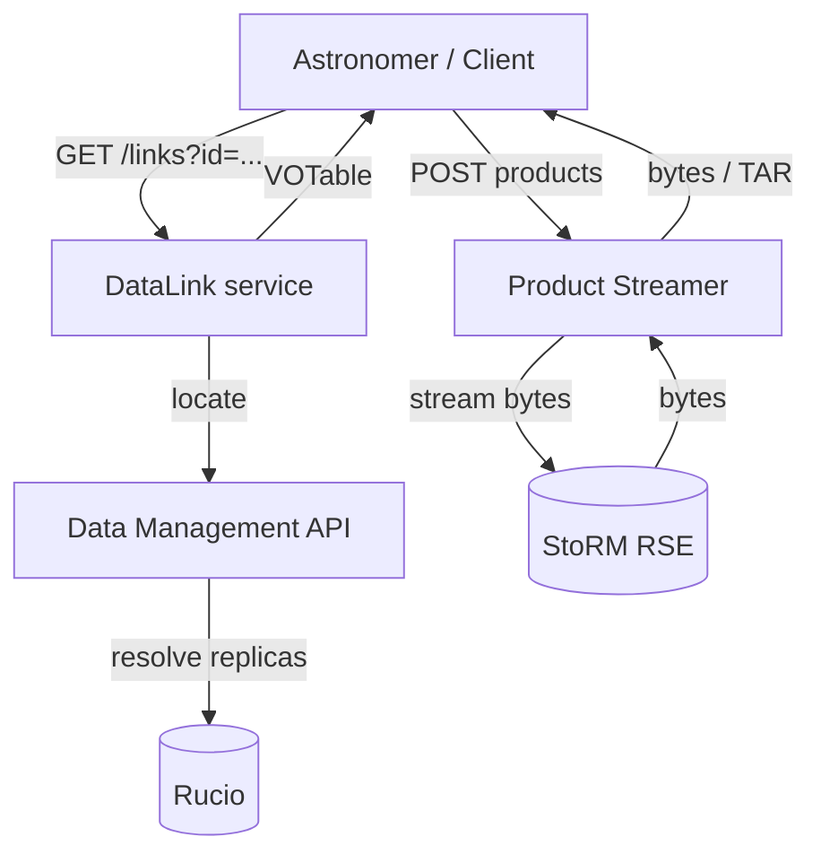
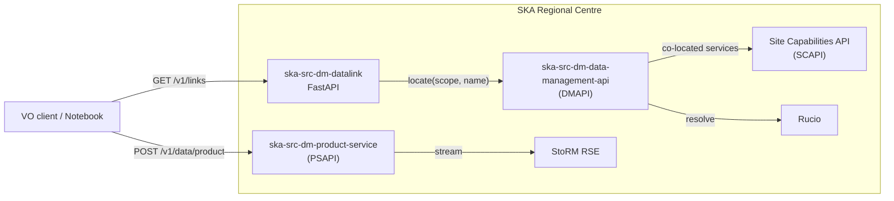
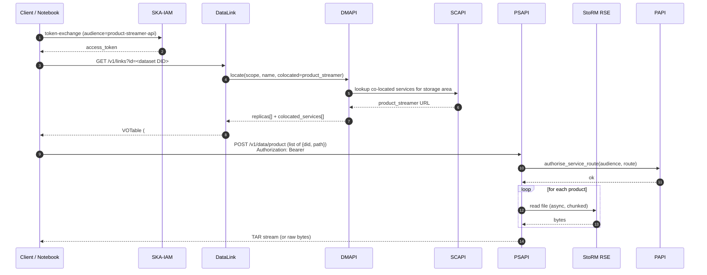

# SKA Regional Centre DataLink & Product Streamer

<div class="text-lg opacity-80 mt-4">
A pragmatic extension of IVOA DataLink for dataset-level access
</div>

<div class="mt-12 text-sm opacity-70">
Michele Delli Veneri &nbsp;·&nbsp; SKA Observatory<br/>
IVOA Interoperability Meeting — Strasbourg, May 2026
</div>

<div class="abs-br m-6 text-xs opacity-60">
SRCNet Data Management WG
</div>

<!--
Quick reminder for the speaker: this is a 20-minute slot for the DAL session.
Goal of the talk: explain how the SKAO has implemented DataLink, where it
diverges from the standard, and how it composes with our Product Streamer
service. Open up discussion about whether the divergence is reasonable.
-->

---
layout: two-cols-header
---

# Outline

::left::

- The problem: shipping SKA data products to scientists
- IVOA DataLink in 90 seconds
- SKAO DataLink: what we built
- Where we diverge from the standard

::right::

- The Product Streamer (PSAPI)
- End-to-end demo (auth challenge → TAR stream)
- Open questions for the community

---
layout: section
---

# 1 · Context

The data-product problem at SKA scale

---

# Where products come from

<div class="grid grid-cols-2 gap-8 text-sm">

<div>

**SKAO will produce ~700 PB / year of science-ready data products.**

Products live across a federation of SKA Regional Centres (SRCs):

- Files are physically stored on **Rucio Storage Elements** (RSEs) — typically StoRM WebDAV
- Identifiers are **Rucio DIDs** of the form `scope:name`
- A *dataset* DID is a Rucio container whose constituents are *file* DIDs
- Authentication is **OIDC** via SKA-IAM (token audiences gate every service)

</div>

<div>



</div>
</div>

---

# What we need DataLink to do

A scientist holds a Rucio DID and wants to **download a data product** — which is almost always **many files** (FITS images, weights, primary beam, metadata sidecars, …).

<v-clicks>

- Resolve a DID → physical access URLs (PFNs) on a chosen replica
- Surface co-located services for that storage area: **SODA cutouts**, **product streaming**, …
- Stay compatible with VO clients that already speak DataLink (TOPCAT, Aladin, pyVO)
- Survive at scale: a single observation can be **thousands of files**

</v-clicks>

---
layout: section
---

# 2 · IVOA DataLink, briefly

`REC-DataLink-1.1` — 2023-12-15

---

# The `{links}` endpoint

<div class="grid grid-cols-2 gap-8 text-sm">

<div>

A DALI-sync resource. The client sends one or more **ID** values; the service responds with a **VOTable** of links.

```
GET {base}/links?ID=<dataset-id>
   → application/x-votable+xml;content=datalink
```

**Mandatory parameters**

- `ID` — one or more identifiers
- `RESPONSEFORMAT` — supported as a no-op for `votable`

Each row in the response has **one of** `access_url`, `service_def`, or `error_message`.

</div>

<div>

**Required columns** (Table 1, §3.2)

| column | purpose |
|---|---|
| `ID` | input identifier |
| `access_url` | URL to data or service |
| `service_def` | ref to a `<RESOURCE>` |
| `error_message` | when no URL can be built |
| `semantics` | term from a vocabulary |
| `description` | human-readable label |
| `content_type` | MIME type |
| `content_length` | bytes |

`semantics` values like `#this`, `#preview`, `#progenitor`, `#cutout` come from <br/>`http://www.ivoa.net/rdf/datalink/core`.

</div>
</div>

---

# Service descriptors (§4)

A `RESOURCE type="meta" utype="adhoc:service"` block describes **how to invoke a related service** — its `accessURL`, optional `standardID`, and the `<GROUP name="inputParams">` block.

```xml {all|2-4|5-9}
<RESOURCE type="meta" ID="soda-sync" utype="adhoc:service">
  <PARAM name="accessURL"   value="https://example.org/soda"/>
  <PARAM name="standardID"  value="ivo://ivoa.net/std/SODA#sync-1.0"/>
  <GROUP name="inputParams">
    <PARAM name="ID"     ucd="meta.id;meta.dataset" value="ivo://..."/>
    <PARAM name="CIRCLE" ucd="obs.field" datatype="double" arraysize="3"/>
    <PARAM name="BAND"   ucd="em.wl;stat.interval" datatype="double" arraysize="2"/>
  </GROUP>
</RESOURCE>
```

This is the **extension point** every DAL service uses to ship "what to do next" to the client without inventing new MIME types.

---
layout: section
---

# 3 · SKAO DataLink

`ska-src-dm-datalink` — what we built and why

---

# The SKAO stack around DataLink



DataLink is a **thin bridge**: it asks DMAPI to *locate* a DID, then formats the answer as a VOTable.

---

# The `/links` route — single entry point

```py {all|6-9|11-15}
@api_version(1)
@datalink_router.get("/links", response_class=HTMLResponse, tags=["DataLink"])
async def links(
    request: Request,
    params: DataLinkParameters = Depends(),
    dm_token: str = Depends(get_dm_token),
) -> HTMLResponse:
    """Generate DataLink XML for a given DID."""
    did_data = datalink_tasks.fetch_did_data(
        params.did, params.client_ip_address,
        params.sort, params.must_include_soda, dm_token,
    )
    is_dataset = did_data["is_dataset"]
    if is_dataset:
        return _render_dataset_response(...)   # ← the divergence lives here
    return _render_file_response(...)
```

One DID in. One VOTable out. **The branch on `is_dataset` is the interesting bit.**

---
layout: two-cols-header
---

# Divergence #1 · Dataset → one call, all children

::left::

**Standard expectation**

Submit ID values in batches; the server returns *one or more rows per ID*.

To get every file in a dataset of *N* constituents the typical client pattern is:

1. `GET /links?ID=<dataset>` → discover constituents (registry-style)
2. `GET /links?ID=<file_1>` → PFN for file 1
3. `GET /links?ID=<file_2>` → PFN for file 2
4. … *N* round-trips total

::right::

**SKAO behaviour**

A single `GET /links?id=<dataset>` returns the **PFNs for every constituent** plus the co-located service descriptors — **in one VOTable**.

```python
if is_dataset:
    for entry in location_response:
        for replica in entry["replicas"]:
            constituent_links.append({
              "access_url": replica,
              "path_on_storage": ...,
              "semantics": "#child",
            })
```

One round-trip; client can build the whole download payload.

---

# What the dataset VOTable looks like

```xml {all|3-13|15-20}
<VOTABLE ...>
  <RESOURCE type="results"><TABLE>
    <!-- one row per constituent file, all with semantics=#child -->
    <TR>
      <TD>ivo://local.srcdev.skao.int?SKA-Mid.integration/02/ba/.../test_0.fits</TD>
      <TD>davs://storm2.local:8444/sa/.../test_0.fits</TD>
      <TD/><TD/>
      <TD>#child</TD>
      <TD>Constituent file</TD>
      <TD>application/octet-stream</TD>
      <TD/><TD/>
    </TR>
    <!-- … #child rows for every other file in the dataset … -->
  </TABLE></RESOURCE>

  <RESOURCE type="meta" ID="product-streamer" utype="adhoc:service">
    <PARAM name="accessURL" value="http://psapi-core:8080/v1/data/product"/>
    <GROUP name="inputParams">
      <PARAM name="ID" ucd="meta.id;meta.dataset" value="ivo://...?<scope>/<name>"/>
    </GROUP>
  </RESOURCE>
</VOTABLE>
```

Each `#child` row carries a **per-file IVOA ID** whose query-string fragment is the path on storage — the client can derive every local path without a second call.

---

# Why we did it this way

<v-clicks>

- **Network economics.** SRCs are globally distributed; a 1500-file VLBI dataset over 200 ms RTT is ~5 min of pure latency at one-call-per-file.
- **Atomic snapshot.** All children come from the *same* `locate` response, so replica selection and co-located services stay consistent for the whole dataset.
- **Clients stay simple.** A notebook can parse one VOTable, build one POST body, and stream the whole product.
- **`#child` is already in the core vocab** — we are using it in the spirit the spec describes (multiple files per dataset, §1.2.1), just at the *response* level rather than via recursion (§1.2.7).

</v-clicks>

<v-click>

<div class="mt-6 p-4 bg-yellow-50 dark:bg-yellow-900/20 border-l-4 border-yellow-500 text-sm">
  <b>The tension:</b> the spec assumes <i>one ID → links for that ID</i>. We're returning <i>one dataset ID → links for the dataset and every constituent</i>. Is that a legitimate generalisation, or do we owe the community a `#child`-recursion sidecar?
</div>

</v-click>

---

# Divergence #2 · The `product-streamer` service descriptor

<div class="text-sm">

A non-standard service type, advertised as a co-located service from **SCAPI** (the Site Capabilities API). For every locate, DMAPI returns the active product streamer endpoint for the storage area; DataLink surfaces it as an `adhoc:service` resource.

</div>

```xml
<RESOURCE type="meta" ID="product-streamer" utype="adhoc:service">
  <PARAM name="accessURL" value="http://psapi-core:8080/v1/data/product"/>
  <GROUP name="inputParams">
    <PARAM name="ID" ucd="meta.id;meta.dataset"
           value="ivo://local.srcdev.skao.int?SKA-Mid.integration/02/ba/.../test_0.fits"/>
  </GROUP>
</RESOURCE>
```

No `standardID` (it's a custom service), but the descriptor is plain DataLink §4: the client follows the `accessURL` and substitutes the `ID` it cares about.

A `#product-stream` row in the results table cross-references this descriptor for clients that prefer to discover services through the table.

---
layout: section
---

# 4 · The Product Streamer

`ska-src-dm-product-service` — PSAPI

---

# What PSAPI does

<div class="grid grid-cols-2 gap-6 text-sm">

<div>

A **streaming proxy** in front of the StoRM RSE filesystem.

- Single `POST /v1/data/product` route
- Body: a list of `{did, path}` items
- One item, file path → raw bytes (with `Range` support, `206 Partial Content`)
- Multiple items (or directory) → **uncompressed TAR stream** (`application/x-tar`)
- No buffering on disk, no intermediate compression

</div>

<div>

```python
@product_router.post("/data/product")
async def post_product(
    request: Request,
    products: list[ProductDID],
):
    caller_token = request.headers.get("authorization", "")\
        .removeprefix("Bearer ").strip()
    if not caller_token:
        raise MissingToken()           # 401 IVOA AuthVO

    safe_paths = [_resolve_safe_path(p.path) for p in products]
    if len(safe_paths) == 1 and os.path.isfile(safe_paths[0]):
        return StreamingResponse(_stream_file(...))
    return StreamingResponse(
        _stream_tar_archive(safe_paths),
        media_type="application/x-tar",
    )
```

</div>
</div>

---

# Auth challenge — IVOA AuthVO conformant

When the caller forgets to send a token, PSAPI replies **401** with a `WWW-Authenticate` payload pointing at the discovery URL of SKA-IAM:

```http {all|1|3-4|5}
HTTP/1.1 401 Unauthorized
Content-Type: application/json

{ "detail": "Unauthorized WWW-Authenticate: ivoa_bearer
   error=\"invalid_request\",
   error_description=\"Missing access token\",
   discovery_url=\"https://ska-iam.stfc.ac.uk/.well-known/openid-configuration\"" }
```

This is the **`ivoa_bearer` challenge** from the IVOA AuthVO note — clients that don't know our IAM can fetch the well-known document, run a token exchange for the `product-streamer-api` audience, and retry.

A second `401` is raised by the **Permissions API** (PAPI) if the token's audience doesn't match — that's the audience check, not just a presence check.

---
layout: section
---

# 5 · End-to-end demo

`demo/product_streamer_demo.ipynb`

---

# Step 1 — Acquire a scoped token

```python
from ska_test_utils.auth import get_psapi_token

# admin token exchanged for product-streamer-api audience
psapi_token = get_psapi_token()
```

The notebook uses an `OAuth2Session` client-credentials grant against SKA-IAM, with `audience=product-streamer-api`. In production a user obtains the token interactively; the audience is the **only** thing PSAPI's permission check looks at beyond presence.

<div class="mt-4 text-xs opacity-70">

The same pattern is what DataLink itself uses to talk to DMAPI — see `OAuth2ServiceToken.get()` in `ska-src-dm-datalink`. The chain of audiences is the trust boundary.

</div>

---

# Step 2 — Query DataLink for the dataset

```python {all|1-6|8-18}
dataset_did = "SKA-Mid.integration:EB-E6E2BBFC.product-0e8afdfc"

dl = requests.get(
    f"{DATALINK_URL}/v1/links",
    params={"id": dataset_did}, timeout=30,
)

root = ET.fromstring(dl.content)
ps_res = root.find('.//v:RESOURCE[@ID="product-streamer"]', VOTABLE_NS)
product_streamer_url = ps_res.find('.//v:PARAM[@name="accessURL"]', VOTABLE_NS).get("value")

products_payload = []
for row in root.findall('.//v:RESOURCE[@type="results"]//v:TR', VOTABLE_NS):
    tds = row.findall("v:TD", VOTABLE_NS)
    if "#child" in [td.text for td in tds if td.text]:
        ivoa_id = tds[0].text
        path_on_storage = ivoa_id.split("?", 1)[1]   # everything after '?'
        products_payload.append({"did": ..., "path": f"/storm-rse2/{path_on_storage}"})
```

**One round-trip** to DataLink and we have a fully formed POST body for PSAPI.

---

# Step 3 — Stream the dataset as a TAR archive

```python
response = requests.post(
    product_streamer_url, json=products_payload,
    headers={"Authorization": f"Bearer {psapi_token}"},
    stream=True, timeout=(30, 600),
)

# Content-Type: application/x-tar
with tarfile.open(fileobj=BytesIO(response.content), mode="r:") as tar:
    members = tar.getmembers()
```

```
Status          : 200
Content-Type    : application/x-tar
TAR archive contains 3 member(s):
  test_EB-E6E2BBFC_0.fits     1,048,576 bytes
  test_EB-E6E2BBFC_1.fits     1,048,576 bytes
  test_EB-E6E2BBFC_2.fits     1,048,576 bytes
```

The tarball is **built on the fly** as bytes are pulled off the RSE — memory usage on PSAPI stays flat regardless of dataset size.

---

# Step 4 — What happens if you misbehave

<div class="grid grid-cols-2 gap-6 text-sm">

<div>

**No token**

```python
requests.post(ps_url, json=[...])
# → 401
# detail: Unauthorized WWW-Authenticate:
#   ivoa_bearer error="invalid_request",
#   discovery_url="https://ska-iam.../.well-known/..."
```

The discovery URL is the *bootstrap*: a generic VO client can follow it to learn how to talk to our IAM.

</div>

<div>

**Wrong audience**

```python
raw_token = get_user_token()  # not exchanged
requests.post(ps_url, json=[...],
  headers={"Authorization": f"Bearer {raw_token}"})
# → 401 from PAPI audience check
```

PAPI is the policy enforcement point: it owns route-level permissions and audience validation. PSAPI itself only checks presence.

</div>
</div>

---

# Full sequence



---
layout: section
---

# 6 · Open questions

For the DAL WG to chew on

---

# Where we'd like community input

<v-clicks>

- **Dataset-level DataLink.** Is "one dataset ID → many `#child` rows in one VOTable" a legitimate reading of the spec, or is the recursive-DataLink pattern (§1.2.7) the only blessed shape? The cost of recursion at SKA scale is real.
- **Custom service descriptors.** `#product-stream` and a custom `accessURL` with a single `ID` input feels like the simplest possible service descriptor — but should we register a `standardID` for "give me bytes for this DID"?
- **AuthVO `ivoa_bearer` + discovery URL.** Our 401 payload encodes the IAM discovery URL inline. Is that the convention people are converging on, or do you prefer registering the IAM as an SSO endpoint elsewhere?
- **`link_auth` and `link_authorized`.** We don't emit these today. Worth adding given that all our PFNs need a token to download?

</v-clicks>

---
layout: center
class: text-center
---

# Thank you

<div class="text-base opacity-80 mt-6">
Code &nbsp;·&nbsp; <code>gitlab.com/ska-telescope/src/src-dm/ska-src-dm-datalink</code><br/>
&nbsp; &nbsp; &nbsp; &nbsp; <code>gitlab.com/ska-telescope/src/src-dm/ska-src-dm-product-service</code><br/>
Slides &nbsp;·&nbsp; <code>github.com/MicheleDelliVeneri/IVOA-Strasbourg-Product-Streamer</code>
</div>

<div class="mt-10 text-sm opacity-60">
michele.delliveneri@skao.int &nbsp;·&nbsp; SKAO Data Management
</div>
